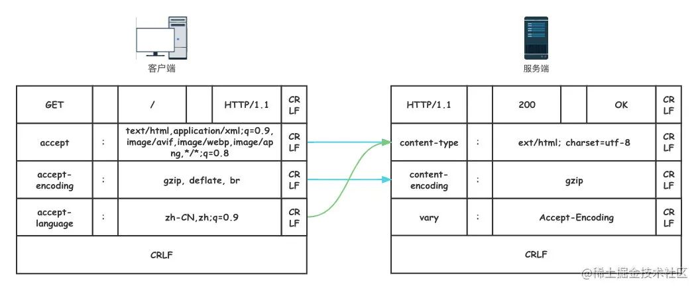
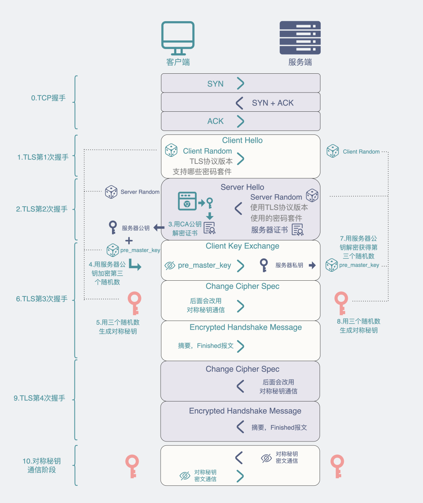

# HTTP

HTTP协议即**超文本传送协议(HyperTextTransfer Protocol )**，是Web联网的基础，也是手机联网常用的协议之一，HTTP协议是建立在TCP协议之上的一种应用层协议。

## 请求报文和响应报文

HTTP 协议的请求报文和响应报文的结构基本相同，由三大部分组成：

- 起始行（*start line*）：描述请求或响应的基本信息；
- 头部字段集合（*header*）：使用 key-value 形式更详细地说明报文；
- 消息正文（*entity*）：实际传输的数据，它不一定是纯文本，可以是图片、视频等二进制数据。

## 请求报文

```
//请求行：方法字段 URL字段 HTTP版本字段
POST /somedir/page.html HTTP/1.1
//请求头 首部行
Host: www.user.com
Content-Type: application/x-www-form-urlencoded
Connection: Keep-Alive
User-agent: Mozilla/5.0
Accept-lauguage: en-us

//此处必须有一空行 分割header和请求内容
//请求体
name=world 
```

### 1、请求行

请求行一般用来描述客户端要怎样操作服务端的资源，一般由三个部分组成。通常使用空格（space）来分隔，最后要用 CRLF 换行表示结束。


### 2、请求头

- Host：指明了该对象所在的主机

- Connection：Keep-Alive 首部行用来表明该浏览器告诉服务器使用持续连接

- Content-Type
  - `application/x-www-form-urlencoded`：表明 HTTP 会将请求参数用`key=value&表单的形式传过去，放到请求实体里面
  - `text/html; charset=utf-8`
  - `application/json;charset=UTF-8`：body请求体是json
  - `multipart/form-data`：上传图片
  
- User-Agent：首部行用来指明用户代理，即向服务器发送请求的浏览器类型

- Accept-lauguage：首部行表示用户想得到该对象的法语版本（如果服务器中有这样的对象的话），否则，服务器应发送它的默认版本（zh_CN）

- Accept-Encoding

  gzip, deflate

- Authorization

  - 请求接口需要传用户信息进行验证，将用户token放在网络请求的头部。

- Accept

  application/json

- Cookie

### 3、空行CRLF

### 4、请求体

## 响应报文

### 1、状态行

状态行一般用来描述服务端对于客户端的请求回复的状态，一般也是由三个部分组成。


#### 状态码

状态行中的状态码是一个十进制的数字，RFC 标准把状态码分成了五类，用数字的第一位表示分类，状态码的可用范围100~599。这五类的具体含义是：

- 1××：提示信息，表示目前是协议处理的中间状态，还需要后续的操作；
- 2××：成功，报文已经收到并被正确处理；
- 3××：重定向，资源位置发生变动，需要客户端重新发送请求；
- 4××：客户端错误，请求报文有误，服务器无法处理；
- 5××：服务器错误，服务器在处理请求时内部发生了错误。

### 2、响应头

请求行或状态行再加上头部字段集合就构成了 HTTP 报文里完整的请求头或响应头。

除了起始行以外，请求头和响应头的结构基本相同。

HTTP 头字段非常灵活，不仅可以使用标准里的 Host、Connection 等已有头，也可以任意添加自定义头。不过使用头字段需要注意下面几点：

- 字段名不区分大小写，例如“Host”也可以写成“host”，但首字母大写的可读性更好；

- 字段名里不允许出现空格，可以使用连字符“-”，但不能使用下划线“_”。例如，“test-name”是合法的字段名，而“test name”“test_name”是不正确的字段名；

- 字段名后面必须紧接着“:”，不能有空格，而“:”后的字段值前可以有多个空格；

- 字段的顺序是没有意义的，可以任意排列不影响语义；

- 字段原则上不能重复，除非这个字段本身的语义允许，例如 Set-Cookie。

  

### 3、空行CRLF

### 4、响应体

## HTTP的特点

1. 灵活可扩展：HTTP在诞生之初只规定了报文的基本格式，比如用空格分隔单词，用换行分隔字段，“header+body”等，报文里的各个组成部分都没有做严格的语法语义限制，可以由开发者任意定制。而那些 RFC 文档，实际上也可以理解为是对已有扩展的“承认和标准化”，实现了“从实践中来，到实践中去”的良性循环。
2. 可靠传输:  **HTTP 协议是基于 TCP/IP** 的，TCP是一个“可靠”的传输协议。
3. 应用层的协议: HTTP 凭借着可携带任意头字段和实体数据的报文结构，以及连接控制、缓存代理等方便易用的特性，HTTP 几乎可以传递一切东西，满足各种需求，称得上是一个“万能”的协议。
4. 请求 - 应答：请求 - 应答模式是 HTTP 协议最根本的通信模型，通俗来讲就是“一发一收”。请求 - 应答模式也明确了 HTTP 协议里通信双方的定位，永远是请求方先发起连接和请求，是主动的，而应答方只有在收到请求后才能答复，是被动的，如果没有请求时不会有任何动作。
5. 无状态： “状态”其实就是客户端或者服务器里保存的一些数据或者标志，记录了通信过程中的一些变化信息。HTTP在整个协议里没有规定任何的“状态”，但HTTP是“灵活可扩展”的，虽然标准里没有规定“状态”，但完全能够在协议的框架里给它“打个补丁”，增加这个特性(cookies，session，application)。
6. 明文传输: “明文”意思就是协议里的报文（准确地说是 header 部分）不使用二进制数据，而是用简单可阅读的文本形式。
7. 不安全: 安全有很多的方面，明文只是“机密”方面的一个缺点，在“身份认证”和“完整性校验”这两方面 HTTP 也是欠缺的。

## HTTP的实体数据

### 数据类型

#### Accept

在TCP/IP协议栈里，数据的传输都是Header+body的形式。在传输层协议中，不需要关心数据是什么，但在应用层必须要告诉上层数据的类型，否则上层就不知该如何处理。

最早的HTTP协议中，并没有附加的数据类型信息，所有传送的数据都被客户程序解释为HTML文档，而为了支持多媒体数据类型，HTTP协议中就使用了附加在文档之前的MIME(Multipurpose Internet Mail Extensions 多用途互联网邮件扩展类型)指定的数据类型信息来标识数据类型。

MIME将数据分为七大类（video、image、application、text、audio、multipart、message），再以type/subtype的格式细分出其下的子类。例如我们常用到的text/html 、text/css 、image/jpeg 、 applaction/json等。

#### Accept-encoding

HTTP协议还制定了数据的压缩格式：

- gzip：GNU zip 压缩格式，也是互联网上最流行的压缩格式；
- deflate：zlib（deflate）压缩格式，流行程度仅次于 gzip；
- br：一种专门为 HTTP 优化的新压缩算法（Brotli）。

#### Accept-Language

标记了客户端可理解的自然语言，也允许用“,”做分隔符列出多个类型，例如：`Accept-Language: zh-CN, zh, en`

### 数据类型在请求头中的表现

在 HTTP 协议里用 Accept、Accept-Encoding、Accept-Language 等请求头字段进行内容协商的时候，还可以用一种特殊的“q”参数表示权重来设定优先级，这里的“q”是“quality factor”的意思。权重的最大值是 1，最小值是 0.01，默认值是 1，如果值是 0 就表示拒绝。具体的形式是在数据类型或语言代码后面加一个“;”，然后是“q=value”。服务器会在响应头里多加一个 Vary 字段，记录服务器在内容协商时参考的请求头字段。



## HTTP传输大文件

### 数据压缩

前面提到的`accept-encoding`请求头可以算是是一种传输大文件的解决方式，服务器可以选择一种浏览器支持的数据压缩方式放进`content-encoding`响应头里，再把原数据压缩后返回给客户端。缺点是这种方式只对文本有较好地压缩率，对于图片音频等本身就已经高度压缩的多媒体数据束手无策。

### 分块传输

在HTTP头部表示为`Transfer-Encoding: chunked`，指报文里的body部分不是一次性发过来的，而是分为许多`chunked`分块发送。

`Transfer-Encoding: chunked`和`Content-Length`这两个字段是互斥的，也就是说响应报文里这两个字段不能同时出现，一个响应报文的传输要么是长度已知，要么是长度未知（chunked）。

### 范围请求

如果想获取某个大文件其中的片段，分块传输就没办法满足这样的需求。HTTP协议提出了范围请求这样的概念，允许客户端只获取文件的某一部分。客户端先发个HEAD请求看看服务器是否支持范围请求，服务器必须在`Accept-Ranges`响应头中告知客户端是否具有范围请求的能力。

请求头`Ranges`是HTTP范围请求的专用字段，值的格式是`bytes=x-y`表示`x ~ y`之间的范围。服务端在收到 `Ranges`请求头时，首先验证x-y的范围是否合法（x和y可以省略，省略x则表示从后往前，省略y则表示从前往后），其次计算读取偏移量，返回206状态码和所读取的文件 ，最后在响应头加上`Content-Range`表示实际返回的偏移量和总数,格式为`bytes x-y/length`。

范围请求还支持在一个头里定义多个`x-y`，这种情况需要一种特殊的MIME类型`multipart/byteranges`，表示报文是有多段组成。

## 持久连接

http的通信过程采取请求/应答模式：**客户端发送的每次请求都需要服务器回送响应，在请求结束后，会主动释放连接**。在http0.9/1.0时期，每次发起请求都需要建立连接->发送数据->断开连接，由于整个请求的过程非常短暂，早起的http也称为`短链接`协议。

要保持客户端程序的在线状态，需要不断地向服务器发起连接请求。若服务器长时间无法收到客户端的请求，则认为客户端“下线”，若客户端长时间无法收到服务器的回复，则认为网络已经断开。

### Connection：keep-alive

HTTP1.1提出了长连接的概念，也就是`Keep-alive`。在长连接上建立一次TCP连接可以发送多个HTTP请求，并且多个请求可以重叠进行，不需要等待一个请求结束后再发送下一个请求。

持久连接情况下，服务器发出响应后让 TCP 连接继续打开着。同一对客户/服务器之间的后续请求和响应可以通过这个连接发送。

因为连接是`alive`的，如果一直不关闭，就会占用大量的服务器资源，导致服务无法及时响应真正的请求，所以需要及时关闭连接。可以通过在客户端请求头添加`Connection: close`字段主动关闭连接。服务端通常不会主动关闭连接，但我们也可以通过设置时长、请求数等方式约定断开连接的条件。

## 队头阻塞

基于`请求-应答`模式的http协议，形成了串行的请求队列（`http1.1还提出了管道机制，即在同一个TCP连接上不用等待上一个请求的响应即可发出下个请求，不过客户端还是按照正常顺序接受响应，这种做法并没带来任何性能上的改善，所以默认保持关闭`），如果队首的请求处于阻塞状态，那么后面的请求也无法正常响应结果就是更长时间的性能浪费。

`并发连接`和`域名分片`是对队头阻塞的针对性优化策略，

并发连接：浏览器限制每个客户端可以并发建立6～8个连接。

域名分片：可以将多个域名指向同一个服务器，这样实际的连接数量就更多了，是一种用数量解决质量的思路。

## 相关属性

### 生存周期

`Expires`俗称“过期时间”，用的是绝对时间点，可以理解为“截止日期”（deadline）。

`Max-Age`用的是相对时间，单位是秒，浏览器用收到报文的时间点再加上 Max-Age，就可以得到失效的绝对时间。

`Expires` 和 `Max-Age` 可以同时出现，两者的失效时间不一致时浏览器会优先采用`Max-Age`计算失效期。如果服务器不设置Max-Age、Expries或者字段值为0指不能缓存cookie，但在会话期间是可用的，浏览器会话关闭之前可以用cookie记录用户的信息。

### 作用域

`Domain`和`Path`指定了 Cookie 所属的域名和路径，浏览器在发送 Cookie 前会从 URI 中提取出 host 和 path 部分，对比 Cookie 的属性。如果不满足条件，就不会在请求头里发送 Cookie。通常 Path 就用一个“/”或者直接省略，表示域名下的任意路径都允许使用 Cookie。

### 安全性

`HttpOnly`表示此 Cookie 只能通过浏览器 HTTP 协议传输，禁止其他方式访问。这也是预防“跨站脚本”（XSS）攻击的有效手段。

`SameSite`可以防范“跨站请求伪造”（XSRF）攻击，`SameSite = strict`表示禁止cookie在跳转链接时跨域传输。`SameSite = lax`稍微宽松一点，允许在`GET`、`HEAD`等安全请求方式中跨域携带。默认值为`none`,表示不限制cookie的携带和传输。

`Secure`表示这个cookie仅能用HTTPS协议加密传输，明文的HTTP协议会禁止发送。但Cookie本身不是加密的，浏览器里还是以明文的形式存在。

## HTTP缓存

### 服务器的缓存

浏览器在访问页面资源时首先会查找缓存数据，如果没有再发送请求，向服务器获取资源；服务器响应请求，返回资源，同时标记资源的有效期；浏览器缓存资源，等待下次重用。这就是客户端缓存。

服务器标记资源有效期使用的头字段是`Cache-Control`，里面的值`max-age=xxx`就是资源的有效时间（与cookie的max-age不同，这里的max-age时间的计算起点是响应报文的创建时刻）。

此外在响应报文里还可以用其他的值来更精确地指示浏览器应该如何使用缓存：
`no-store`: 不允许缓存，用于某些变化非常频繁的数据，例如秒杀页面；
`no-cache`: 可以缓存，但在使用之前必须要去服务器验证是否过期；
`must-revalidate`: 如果缓存不过期就可以继续使用，但过期了就必须去服务器验证。

### 客户端的缓存控制

浏览器也可以发`Cache-Control`，也就是说`请求 - 应答`的双方都可以用这个字段进行缓存控制，互相协商缓存的使用策略。在浏览器前进、后退、重定向时cache-control就生效了，响应头里有`from disk cache`字样，就说明浏览器未发送请求，而是直接使用了本地缓存。

#### 条件请求

浏览器在刷新页面时相当于在请求头中添加了`Cache-Control:no-cache`，这样在刷新页面时，还是向服务端发送了请求，并没有很好的利用到缓存。所以HTTP协议又定义了一系列“If”开头的“条件请求”字段，专门用来检查验证资源是否过期。

条件请求一共有 5 个头字段，我们最常用的是`if-Modified-Since`和`If-None-Match`这两个。需要第一次的响应报文预先提供`Last-modified`（最后修改时间）和`ETag`（资源唯一标识），然后第二次请求时就可以带上缓存里的原值，验证资源是否是最新的。如果资源没有变，服务器就回应一个“304 Not Modified”，表示缓存依然有效，浏览器就可以更新一下有效期，然后放心大胆地使用缓存了。

### 代理缓存

#### 代理服务器

代理服务器就是客户端和服务端之间的中间商，在中间的位置转发上游的请求和下游的响应。代理服务器在计算机领域有非常重要的功能

- 负载均衡：面向客户端时屏蔽原服务器，代理服务器可以通过轮询、哈希等算法将流量分发，提高整体的性能。
- 健康检查：使用‘心跳’等机制监控服务器，保证服务器的可用性。
- 安全防护：保护被代理服务端的IP和流量，防止网络攻击或负载问题。
- 加密卸载：对外和对内使用不同的加密策略，节省加密成本
- 内容缓存：暂存/复位服务器的响应。

#### 缓存代理

HTTP的服务端缓存主要由代理服务器来实现，代理服务器收到源服务器的响应之后将报文转发给客户端的同时也存入自己的cache里，下次再有相同的请求就可以直接发送304或者缓存数据，节省源服务器的成本。

因为代理服务器`既是服务端，又是客户端`的特性，有一些特殊的`cache-control`属性：

- 服务端

`private`: 表示只能客户端缓存，不允许代理服务器上缓存。
`punlic`:表示完全公开，客户端和代理服务器都可以缓存。
`proxy-revalidate`:要求代理服务器缓存过期后必须回源验证。
`s-maxage`: 代理服务器缓存的有效期
`no-transform`: 不允许代理服务器转换数据格式。

- 客户端

`max-stale`: 如果代理上的缓存过期了也可以接受，但不能过期太多，超过 x 秒也会不要。
`min-flash`: 表示缓存少于x有效期就不要了。
`only-if-cached`:表示只接受代理缓存的数据，不接受源服务器的响应。如果代理上没有缓存或者缓存过期，就应该给客户端返回一个 504。


## HTTPS

网页广告：网页被劫持，注入恶意代码导致。

浏览器上如果不是https就会提示不安全的警告。

**加解密和数字证书是保证https安全的关键。**

**HTTPS（Hyper Text Transfer Protocol over Secure Socket Layer）。**

HTTPS 协议 = `HTTP 协议 + SSL/TLS 协议`构建的可进行加密传输、身份认证的网络协议。

在HTTP下加入SSL层，HTTPS的安全基础是SSL，因此加密的详细内容就需要SSL。HTTPS存在不同于HTTP的默认端口及一个加密/身份验证层（在HTTP与TCP之间）。

HTTP协议以明文方式发送内容，没有数据加密。攻击者可以截获、修改或者伪造Web浏览器和网站服务器之间的传输报文，数据不具有可信性。

只有具有机密性（加密）、完整性（签名）、身份认证（证书）和不可否认性，才认为这个请求是安全的。

HTTP和HTTPS使用的是完全不同的连接方式，用的端口也不一样，前者是80，后者是443。

### SSL/TLS

SSL 安全套接层协议（Secure Sockets Layer），为网络通信提供**安全**及**数据完整性**的一种安全协议。在 OSI 模型中处于第 5 层（会话层），由网景公司于 1994 年发明。SSL 发展到 v3 时已经证明了它自身是一个非常好的安全通信协议，1999 年它改名为 TLS（传输层安全协议， Transport Layer Security），目前应用的最广泛的 TLS 是 1.2。

### 机密性（基于TLS1.2）

SSL/TLS通过`加密（encrypt）`来传输`密文（cipher text）`保证数据传输的安全性，只有拥有`密钥(key)`的人才能够通过`解密(decrypt)`获得`明文（plain text/clear text）`，加密解密的操作过程就是`加密算法`。

### 密钥

“密钥”是一长串的数字，单位是“位”（bit）。比如，说密钥长度是 128，就是 16 字节的二进制串，密钥长度 1024，就是 128 字节的二进制串。按照密钥的使用方式，加密可以分为两大类：`对称加密`和`非对称加密`。

### 对称加密

加密解密都使用相同的密钥就叫做对称加密。TLS里目前常用的有 AES 和 ChaCha20。

`AES` 的意思是“高级加密标准”（Advanced Encryption Standard），密钥长度可以是 128、192 或 256。它是 DES 算法的替代者。

`ChaCha20` 是 Google 设计的另一种加密算法，密钥长度固定为 256 位，纯软件运行性能要超过 AES，曾经在移动客户端上比较流行，但 ARMv8 之后也加入了 AES 硬件优化，所以现在不再具有明显的优势。

### 非对称加密

对称加密有一个问题就是如何安全的**传输密钥**。因为在加密算法中，只要拥有密钥就可以解密，如果密钥在传输过程中被窃取，也就无机密性可言。为了解决这个问题，又有了`非对称加密`算法。他拥有两个`密钥`,分别是`公钥（public key）`和`私钥（private key）`,`公钥`是公开的，而`私钥`是严格保密的。`公钥`和`私钥`有个特别的`“单向”性`，`公钥`加密后只能用`私钥`解密，`私钥`加密后也只能用`公钥`解密。非对称加密可以解决`密钥交换`的问题。服务器保管私钥，在网上任意分发公钥，你想要登录网站只要用公钥加密就行了，密文只能由私钥持有者才能解密。而黑客因为没有私钥，所以就无法破解密文。

非对称加密算法的设计比对称算法难得多，在 TLS 里只有很少的几种，比如 DH、DSA、RSA、ECC 等。

`RSA` 是其中最著名的一个，它的安全性基于“整数分解”的数学难题，使用两个超大素数的乘积作为生成密钥的材料，想要从公钥推算出私钥是非常困难的。

`ECC`是非对称加密里的“后起之秀”，它基于“椭圆曲线离散对数”的数学难题，使用特定的曲线方程和基点生成公钥和私钥，子算法 ECDHE 用于密钥交换，ECDSA 用于数字签名。相对RSA，ECC在安全和性能上都有更明显的优势，160位的ECC相当于1024位的RSA，260位的ECC相当于2048位的RSA。

### 混合加密

虽然非对称加密没有**密钥交换**的难题，但因为它们都是基于复杂的数学难题，运算速度很慢，即使是 ECC 也要比 AES 差上好几个数量级。所以目前`TLS`使用`混合加密`，既能高效加密解密，又能安全的进行数据传输。

**在建立连接之初先使用非对称加密的形式传递密钥**，然后用随机数产生对称算法使用的“会话密钥”（session key），再用公钥加密。因为会话密钥很短，通常只有 16 字节或 32 字节，所以慢一点也无所谓。对方拿到密文后用私钥解密，取出会话密钥。这样，双方就实现了对称密钥的安全交换，后续就不再使用非对称加密，全都使用对称加密。


### HTTPS握手过程

先是建立TCP连接，HTTP是基于TCP的应用层协议。

在TCP成功建立完协议后，就可以开始进入HTTPS阶段。

HTTPS可以用TLS或者SSL进行加密，以`TLS1.2`为例。

整个加密流程分为**两阶段**：

**第一阶段**是TLS四次握手，这一阶段主要是利用**非对称加密**的特性各种交换信息，最后得到一个**会话秘钥（有期限，每一次会话得到的）**。

**第二阶段**是则是在第一阶段的"会话秘钥"基础上，进行**对称加密**通信。

#### 

#### TLS四次握手

身份认证、协商加密算法、交换加密密钥等。

**1、Client Hello**

- 客户端告诉服务端：TLS协议版本（比如 `TLS1.2`），支持的加密算法（比如`RSA`），同时还给出一个**客户端随机数**。

**2、Server Hello**

- 服务端告诉客户端：**服务器随机数** + 服务器证书（里面有公钥） + 确定的加密协议版本（比如就是TLS1.2）。

**3、浏览器将对称加密密钥用公钥加密后发给服务器**

-  `Client Key Exchange`: 客户端再生成**一个随机数**（前主密钥 `pre_master_key `）。从第二次握手的**服务器证书**里取出服务器公钥，用公钥加密 `pre_master_key`，发给服务器。
-  `Change Cipher Spec`: 客户端**已经拥有三个随机数**：客户端随机数，服务器随机数和pre_master_key，用这三个随机数**根据前面协商好的特定算法**生成一个"**会话秘钥**"。此时客户端通知服务端，后面会用这个会话秘钥进行对称机密通信。
-  `Encrypted Handshake Message`：客户端会把迄今为止的通信数据内容生成一个摘要，用"**会话秘钥**"加密一下，发给服务器做校验，此时客户端这边的握手流程就结束了，因此也叫**Finished报文**。

**第四次握手**：

-  `Change Cipher Spec`：服务端此时拿到客户端传来的 `pre_master_key`（虽然被服务器公钥加密过，但服务器有私钥，能解密获得原文），集齐三个随机数，跟客户端一样，用这三个随机数通过同样的算法获得一个"**会话秘钥**"。此时服务器告诉客户端，后面会用这个"会话秘钥"进行加密通信。
-  `Encrypted Handshake Message`：跟客户端的操作一样，将迄今为止的通信数据内容生成一个摘要，用"**会话秘钥**"加密一下，发给客户端做校验，到这里，服务端的握手流程也结束了，因此这也叫**Finished报文**。

四次握手中，客户端和服务端最后都拥有**三个随机数**。

客户端随机数`client random`、服务器随机数`server random`、客户端产生的前主密钥`pre_master_key`。这三个随机数共同构成最终的**对称加密秘钥**，也就是"**会话秘钥**"。

而这三个随机数中，`client random` 和 `server random` 都是**明文**的。**而`pre_master_key`被服务器的公钥加密过，只有客户端和拥有对应服务器私钥的人知道。**

### 数字证书

- 证书拥有者（例：baidu.com）
- 证书拥有者的公钥
- 证书有效期
- 证书序列号
- 颁发证书的单位机构
- 颁发证书的单位和数字签名

#### 1、证明自己的身份

类似派出所发放的身份证件。

加密了数据是安全的。验证证书是为了确认是想请求的服务器。收到的公钥是网站的，而不是中间攻击者的。数字证书把网站和公钥绑定起来。

所以需要一个第三方角色：服务器除了自己的公钥，还把自己的域名、组织名，以及所申请的第三方机构名等信息放在一起，行成一个数据集合，把这些数据去找第三方机构，第三方机构也有公私钥对，用私钥加密这些数据，得到密文（也称签名），然后把签名和原始明文数据一起发给服务器，这就是TLS证书，第三方机构也称为CA。

服务器给客服端的不是简单的公钥，而是证书，客服端拿到证书之后，拿CA机构公开的公钥对证书中的密文进行解密，如果解密的结果和证书中的明文一致，则通过验证，客户端开始和服务器相互传密钥。

#### 2、传递公钥

解决公钥的发送被中间截获的问题。

服务器传给客户端公钥的时候，可能被中间攻击者篡改，客服端以为收到的是服务器的公钥，依然用它来加密客服端的密钥，攻击者收到后，就能用自己的私钥解密，然后用服务器的公钥进行加密传给服务器。攻击者在客户端和服务器两端之间相互欺骗，客户端和服务器对称加密的密钥也能得到。

### 数字签名

验证数字证书由信任的CA机构颁发的。

防止数字信息被修改，确保数据完整性。

发送方将消息通过HASH算法生成摘要。发送方用自己的私钥对摘要进行加密，形成数字签名。将`消息和签名`一起发送给接收方，接收方用发送方的公钥对数字签名解密，同时对消息用同样的HASH算法生成摘要，将解密后的摘要和收到的摘要对比，hash字符一致则说明消息是发送方发出的，传输过程没有被破坏篡改。

公钥加密，私钥解密信息。

私钥加密数字签名，公钥验签。
