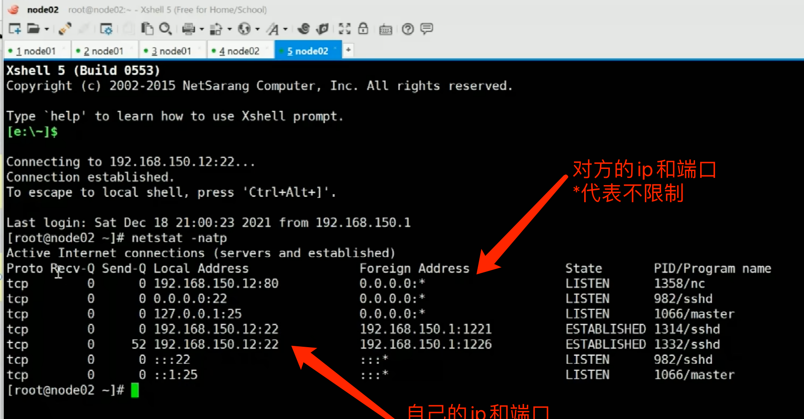
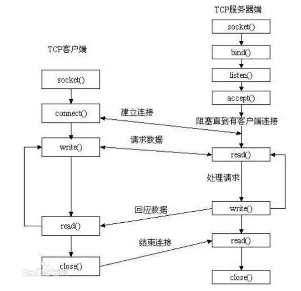
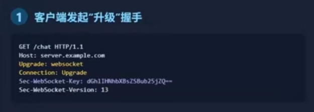

# Socket套接字

程序员开发的网络应用程序位于应用层，TCP和UDP属于传输层协议。在应用层和传输层之间，使用套接字进行分离。

套接字就像传输层为应用层开的一个小口，应用程序通过这个小口向远程发送数据，或接收远程发来数据;

而这个小口以内，也就是数据进入这个口之后，或者数据从这个口出来之前，是不知道也不需要知道的，也不会关心它如何传输，这属于网络其它层次的工作。

socket实际是传输层供给应用层的编程接口。传输层则在网络层的基础上提供进程到进程间的逻辑通道，而应用层的进程则利用传输层向另一台主机的某一进程通信。Socket就是应用层与传输层之间的桥梁。

在实际应用中，客户端到服务器之间的通信防火墙默认会关闭长时间处于非活跃状态的连接而导致 Socket 连接断连，因此需要通过轮询告诉网络，该连接处于活跃状态。

Socket是对TCP/IP协议的封装，因此Socket连接一旦建立，通信双方即可开始相互发送数据内容，直到双方连接断开。

Socket本身并不是协议，而是一个调用接口（API），通过Socket，我们才能使用TCP/IP协议。

## Socket机制

1. Socket是网络服务的一种机制
2. 通信两端都是Socket
3. 网络通信其实就是Socket间的通信
4. 数据在两个Socket之间通过IO传输

## Socket（套接字）

TCP三次握手之后，连接就是内存开辟资源（socket）。

内存开辟的资源有唯一性、可以区别。

例：浏览器打开2个网页，都访问百度。双方发送请求和响应才能到对应的位置。

计算机端口号数量：0 - 65535

socket是通信的基石，是支持TCP/IP协议的网络通信的基本操作单元，包含进行网络通信必须的五种信息：

- 连接使用的协议
- 本地主机的IP地址
- 本地进程的协议端口port
- 远地主机的IP地址
- 远地进程的协议端口port

多个TCP连接或多个应用程序进程可能需要通过同一个TCP协议端口传输数据。为了区别不同的应用程序进程和连接，计算机操作系统为应用程序与TCP/IP协议交互提供了 **套接字(Socket)** 接口。应用层可以和传输层通过Socket接口，区分来自不同应用程序进程或网络连接的通信，实现数据传输的并发服务。

**socket是"打开—读/写—关闭"模式的实现，**建立Socket连接至少需要一对套接字，其中一个运行于客户端，称为ClientSocket，另一个运行于服务器端，称为ServerSocket。

Socket可以支持不同的传输层协议（**TCP/UDP**），当使用TCP协议进行连接时，该Socket连接就是一个TCP连接，UDP连接同理。

套接字之间的连接过程分为三个步骤：**服务器监听，客户端请求，连接确认。**

## socket连接

### 1、服务器监听

服务器端套接字并不定位具体的客户端套接字，而是处于等待连接的状态，实时监控网络状态，等待客户端的连接请求。



Recv-Q：接收队列

Send-Q：发送队列

### 2、客户端请求

指客户端的套接字提出连接请求，要连接的目标是服务器端的套接字。

为此，客户端的套接字必须首先描述它要连接的服务器的套接字，**指出服务器端套接字的地址和端口号**，然后就向服务器端套接字提出连接请求。

### 3、连接确认

当服务器端套接字监听到或者说接收到客户端套接字的连接请求时，就响应客户端套接字的请求，建立一个新的线程，把服务器端套接字的描述发给客户端，一旦客户端确认了此描述，双方就正式建立连接。



如果服务端直接read()没有accpet()，内核可以三次握手连接。可以发送数据，但是没有程序接收。

app读取的是本机内核`socket queue`队列中的数据。当app读取socket队列，队列中没有数据时，如果什么都没给，则是block阻塞，如果给个空，则是`non block`非阻塞。

网络IO是程序与内核之间的过程。IO有阻塞和非阻塞IO。

## queue

客户端和服务端有两个队列：读写队列

## Java

### 双向通信

先运行服务器端，开始等待，才能接收客户端发送的数据。

服务端代码

```java
import java.io.*;
import java.net.ServerSocket;
import java.net.Socket;

public class TestServer {
    public static void main(String[] args) throws IOException {
        System.out.println("服务器端启动");
        //套接字
        ServerSocket ss = new ServerSocket(8888);//指定端口号，ip不需要指定
        //等待客户端发送数据
        Socket s = ss.accept();//一直在等
      	
        //服务器端感受到的是输入流
        InputStream is = s.getInputStream();
        DataInputStream dis = new DataInputStream(is);
        //接收客户端发送的数据
        String str = dis.readUTF();
        System.out.println("接收到客户端：" + str);
      
        //向客户端发送数据
        OutputStream os = s.getOutputStream();
        DataOutputStream dos = new DataOutputStream(os);
        dos.writeUTF("你好客户端，我接收到你的信息了");
      
        //流、网络资源关闭。倒着关
        dos.close();
        os.close();
        dis.close();
        is.close();
        s.close();
        ss.close();
    }
}
```

客户端代码

```java
import java.io.*;
import java.net.Socket;

public class TestClient {
    public static void main(String[] args) throws IOException {
        System.out.println("客户端启动");
        //套接字
        Socket s = new Socket("192.168.0.106", 8888);//两个参数 指定服务器ip 端口
      
        //对于程序员来说，感受利用输出流在传送数据
        OutputStream os = s.getOutputStream();
        //数据流
        DataOutputStream dos = new DataOutputStream(os);
        //传送数据
        dos.writeUTF("你好，服务器，我是客户端");
      
        //对服务器返回的数据做处理
        InputStream is = s.getInputStream();
        DataInputStream dis = new DataInputStream(is);
        String str = dis.readUTF();
        System.out.println("服务器对我说：" + str);
        //流、网络资源关闭。倒着关
        dis.close();
        is.close();
        dos.close();
        os.close();
        s.close();
    }
}
```

## WebSocket

### HTTP 的核心痛点

HTTP 协议存在两个核心痛点，直接限制了实时通信场景的落地：

1. **服务器被动响应**：http是单向请求，服务器无法主动向客户端推送数据，只能等待客户端发起请求后才能回复。例如实时通知场景中，客户端需反复刷新才能获取最新消息，导致实时性差。
2. **头部开销大**：每次 HTTP 请求需携带完整头部信息，频繁通信时带宽浪费严重。例如每秒发送 10 次请求，头部开销占比可能高达 30%，无法满足低开销需求。

### 轮询方案的局限性

为解决 HTTP 的实时性问题，早期出现了轮询方案，但均存在明显缺陷：

#### 定时轮询

- **原理**：客户端通过定时器每隔固定时间发起请求，询问服务器是否有新数据。

- **优点**：实现简单，仅需一个定时器即可。

- **缺点**：绝大多数请求为无效请求，严重浪费客户端和服务器资源；延迟取决于轮询间隔（间隔短则资源消耗大，间隔长则用户体验差）。

- **适用场景**：仅适用于极端遗留系统，无法用于生产环境核心功能。

#### 长轮询

- **原理**：对定时轮询的优化，客户端发起请求后，服务器挂起连接，直到有新数据或超时才回复；客户端收到回复后立即发起下一次请求。

- **优点**：减少无效请求，提升通信效率。

- **缺点**：**服务器需为每个客户端维持挂起连接，高并发时压力大；**每次响应或超时后需重新建立连接，并非真正的持久连接。

- **适用场景**：可作为 WebSocket 的降级方案，不适用于高并发实时场景。

### WebSocket 的优势

WebSocket 是专为实时通信设计的协议，通过建立**双向持久连接**突破 HTTP 的局限，核心优势包括：

1. **真实时连接**：一次连接建立后，客户端与服务器可随时双向传输数据，延迟达毫秒级，满足实时场景需求。
2. **极低开销**：握手成功后，数据帧头部仅 2-10 字节，远低于 HTTP 完整头部开销，减少带宽浪费。
3. **原生双向通道**：服务器可主动推送数据，客户端也可主动发送数据，无需反复建立连接，完美适配实时聊天、行情监控、在线游戏等场景。

**注意**：WebSocket 是状态化协议，服务器需管理大量持久连接，对连接管理能力要求较高；同时需兼容旧浏览器或特殊网络环境。

### WebSocket 的握手流程

WebSocket 通过 HTTP 握手实现协议升级，具体流程如下：

1. **客户端发起升级请求**：客户端向服务器发送 HTTP 升级请求，携带关键头部（如下图），申请切换至 WebSocket 协议。

   

2. **服务器确认切换**：服务器返回 101 状态码（协议切换），并携带对应响应头部（如下图），确认协议升级。


3. **建立双向通道**：握手成功后，HTTP 连接转换为 WebSocket 双向通道，后续数据传输与 HTTP 无关，直接通过该通道进行双向通信。

### 场景选择方案

不同通信场景需选择合适的技术方案：

- **极端遗留环境**（如旧浏览器）：选择定时轮询，实现简单但资源消耗大。

- **低并发低实时需求**（如内部通知）：选择长轮询作为降级方案，减少无效请求。

- **核心实时场景**（如聊天、金融行情、在线游戏）：必须使用 WebSocket，其低开销、实时双向通信特性是最佳选择。

**面试要点**：实际应用中，若 WebSocket 连接失败，需实现优雅降级（自动切换至长轮询），确保核心功能可用性。
