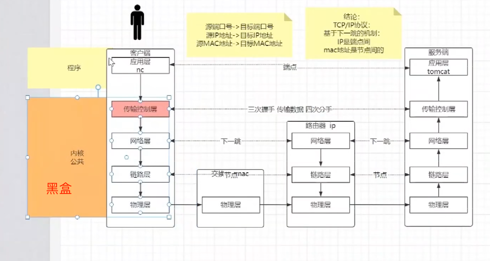

# 网络模型

分层解耦，每层独立的功能，加起来就是一个完整的功能。层内可以替换实现，好扩展。

每一层都有协议。

## OSI七层模型

物理层、数据链路层和网络层通常被称作媒体层，是网络工程师所研究的对象；

传输层、会话层、表示层和应用层则被称作主机层，是用户所面向和关心的内容。

### 1、物理层

主要定义物理设备的标准，如网线的接口类型，各种传输介质，传输速率等。

主要作用是传输比特流（由1、0转化为电流的强弱进行传输，到达目的地后在转为1、0）这一层的数据叫做比特（bit）。

主要设备是集线器。

### 2、数据链路层

将物理层接收来的数据进行**MAC地址的封装与解封装**，常把这一层的数据叫做帧。

主要设备是网卡和交换机。

### 3、网络层

选择合适的网间路由交换节点，确保数据的及时传送。将数据链路层传来的数据进行**IP地址的封装与解封装**。IP协议对应于网络层。

常把这一层的数据叫做数据包。

主要设备有路由器。

### 4、传输控制层

定义了一些传输数据的协议和端口，例如：**TCP、UDP协议**。

### 5、会话层

通过传输层建立数据传输通道，在系统之间发起会话和接受会话请求。示例：RPC，SQL等。

SSL非对称加密。

### 6、表示层

主要对接收的数据进行解释和解压缩。把计算机能够识别的东西转化为人能够识别的东西（如图片，声音等）。

### 7、应用层

主要是一些终端的应用，比如FTP（各种文件下载）、浏览器，qq等

HTTP协议对应于应用层，主要解决如何包装数据。HTTP协议是基于TCP连接的。

TCP/IP是传输层协议，主要解决数据如何在网络中**传输**。**Socket是应用层与TCP/IP协议族通信的中间软件抽象层，是它的一组接口。**

程序：

应用层

内核公共

上面的层 TCP。

协议双方约束，格式。

X86是CPU的指令集。

## TCP/IP五层模型

### 1、物理层：

- 中继器、集线器、还有我们通常说的双绞线也工作在物理层

### 2、数据链路层

负责封装和解封装IP报文，发送和接受ARP/RARP报文等。

- 网桥（现已很少使用）、以太网交换机（二层交换机）、网卡（其实网卡是一半工作在物理层、一半工作在数据链路层）在数据链路层

### 3、网络层

负责路由以及把分组报文发送给目标网络或主机。

- 路由器、三层交换机在网络层

### 4、传输控制层

负责对报文进行分组和重组，并以TCP或UDP协议格式封装报文。

- 传输层主要是四层交换机、也有工作在四层的路由器。

### 5、应用层

TCP/IP协议中的应用层处理七层模型中的第五层、第六层和第七层的功能。TCP/IP协议中的传输层并不能总是保证在传输层可靠地传输数据包，而七层模型可以做到。

负责向用户提供应用程序，比如HTTP、FTP、Telnet、DNS、SMTP等。

## 对比

- 名义上标准：ISO/OSl参考模型
- 事实上标准：TCP/IP协议栈 （Internet使用的协议）

<table border> 
  <tr><th>OSI七层模型</th><th>TCP/IP概念模型</th><th>功能</th><th>TCP/IP协议族</th></tr>
  <tr><td>应用层</td><td rowspan=3>应用层</td><td>文件传输，电子邮件，文件服务，虚拟终端</td><td>TFTP，HTTP，SNMP，FTP，SMTP，DNS，Telnet</td></tr>
  <tr><td>表示层</td><td>数据格式化，代码转换，数据加密</td><td>没有协议</td></tr>
  <tr><td>会话层</td><td>解除或建立与别的接点的联系</td><td>没有协议</td></tr>
  <tr><td>传输层</td><td>传输层</td><td>提供端对端的接口</td><td>TCP,UDP</td></tr>
  <tr><td>网络层</td><td>网络层</td><td>为数据包选择路由。传输过程中选择最优路径（就是路由品，交换机那些具有寻址功能的设备所实现的功能）</td><td>IP,ICMP,RIP,OSPF,BGP,IGMP</td></tr>
	<tr><td>数据链路层</td><td>链路层</td><td>确保数据传输正确，提供检测和纠错功能。</td><td>SLIP，CSLIP,PPP,ARP,RARP,MTU</td></tr>
  <tr><td>物理层</td><td>物理层</td><td>以二进制数据形式在物理媒体上传输数据。定义物理设备的标准-网线的接口类型，光纤的接口类型，各种传输介质的传输連率
变成010101从物理设备中传输出去。</td><td>ISO02110,IEEE802,IEEE802.2</td></tr>
</table>
