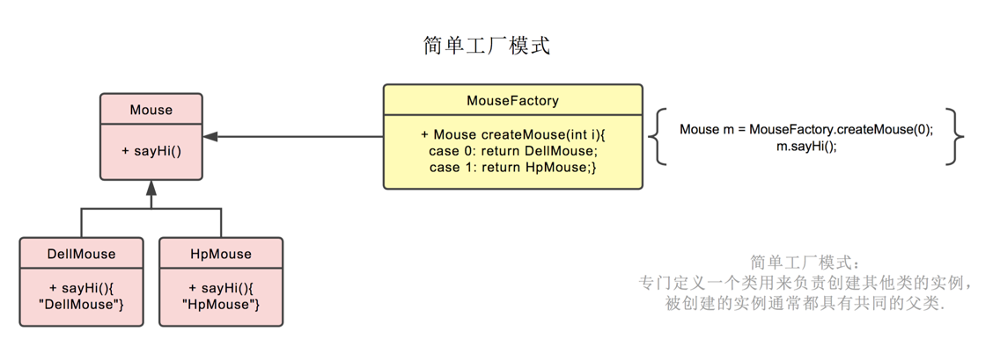
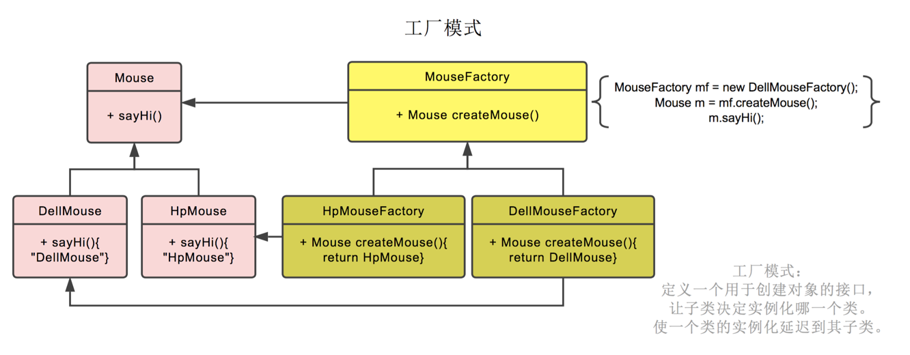

# 工厂模式

## 简单工厂模式

专门生产某个产品的类，有一个工厂方法，依据传入的参数，生成对应的具体产品对象；

比如下图中的鼠标工厂，专业生产鼠标，给参数0，生产戴尔鼠标，给参数1，生产惠普鼠标。

简单工厂模式实现：

1. 定义抽象类 水果类

   定义虚函数。

2. 具体的水果类

   香蕉继承水果类，并实现虚函数重写。

   苹果继承水果类，实现虚函数重写。

3. 定义工厂类，生产水果，返回父类水果指针。

   根据传入的水果类参数，调用不同的水果类生成水果。

   如果传入的是香蕉就生产香蕉对像，传入苹果就生产苹果对象。传入什么参数就生产什么产品，逻辑都在工厂类里。

面向抽象类编程

生产苹果香蕉西红柿，把苹果香蕉西红柿扔给了父类对象。

有继承，有虚函数重写，有父类指针指向子类对象。有多态的发生。

工厂角色负责生产产品。工厂和产品进行解耦合，把产品进行抽象，抽象的产品角色（水果），具体的产品角色（苹果，橘子），想生产苹果就生产苹果，生产香蕉就生产香蕉，返回的是一个父类基类。

### 核心思想

用一个工厂来根据输入的条件产生不同的类，然后根据不同类的virtual函数得到不同的结果

### 补充说明

工厂方法一般设成静态方法，返回值一般是抽象类或接口，具体的产品类一般继承或实现抽象类、接口。

优点：产品使用者不需要关心产品类的创建过程，与具体产品的实现类达到解耦的效果。

缺点：违背"开放--封闭"原则(OCP)，因为新增一个产品类的时候，需要修改原先的工厂方法，所以**简单工厂模式不属于23种GOF设计模式**。

适用场合：当工厂类负责创建的对象比较少的时候。

## 工厂模式

具体的工厂对象负责生产具体的产品对象；

工厂模式也就是鼠标工厂是个父类，有生产鼠标这个接口。

戴尔鼠标工厂，惠普鼠标工厂继承它，可以分别生产戴尔鼠标，惠普鼠标。

生产哪种鼠标不再由参数决定，而是创建鼠标工厂时，由戴尔鼠标工厂创建。

后续直接调用对应的`鼠标工厂.生产鼠标()`即可。

工厂方法模式属于类的创建型模式又被称为**多态**工厂模式 。

面向抽象类编程。工厂也抽象了。

对工厂进行优化。因为产品已经优化过了，抽象的水果类和具体的水果类。可以对工厂进行优化。

### 如果要增加一种新的水果， 不修改工厂，要如何做：

抽象工厂 生产抽象产品。具体工厂，想要香蕉的时候先new一个香蕉工厂。然后用香蕉工厂生产香蕉。
想要提子的时候，就new一个提子工厂。添加一个工厂，去生产新的水果。

这就是工厂模式。实现解耦合。

### 类 角色：

1. 抽象的水果类。虚函数。
2. 具体的水果类（香蕉，苹果，橘子）。实现虚函数。
3. 抽象的工厂，虚函数返回水果基类。
4. 具体的工厂，香蕉工厂继承抽象工厂，实现虚函数生产香蕉。苹果工厂生产苹果。

使用的时候，创建具体的工厂就可以生产具体的水果。想生产哪种水果就创建哪种工厂去生产。

添加新的产品不需要修改原来的代码，只需要新增一个水果工厂去生产水果。新增的工厂要按照抽象工厂实现。

简单工厂模式直接操作工厂在类里修改，直接new一个工厂， 没有办法新增新的工厂。

工厂模式面向抽象类，可以创建多个工厂。实现了客户端和具体产品、具体工厂的解耦合。

### 意义：

工厂方法模式的意义是定义一个创建产品对象的工厂接口，将实际创建工作推迟到子类当中。
核心工厂类不再负责产品的创建，这样核心类成为一个抽象工厂角色，仅负责具体工厂子类必须实现的接口，这样进一步抽象化的好处是使得工厂方法模式可以使系统在不修改具体工厂角色的情况下引进新的产品。

### 补充说明

符合开放--封闭"原则(OCP)，新增产品时，只需新增工厂的实现类、产品的实现类，不修改原来的代码；

属于23种GOF设计模式中的一种；

### 工厂模式和简单工厂模式比较

工厂方法模式与简单工厂模式在结构上的不同不是很明显。

工厂方法类的核心是一个抽象工厂类，而简单工厂模式把核心放在一个具体类上。 

工厂方法模式之所以有一个别名叫多态性工厂模式是因为具体工厂类都有共同的接口，或者有共同的抽象父类。

当系统扩展需要添加新的产品对象时，仅仅需要添加一个具体对象以及一个具体工厂对象，原有工厂对象不需要进行任何修改，也不需要修改客户端，很好的符合了“开放－封闭”原则。而简单工厂模式在添加新产品对象后不得不修改工厂方法，扩展性不好。工厂方法模式退化后可以演变成简单工厂模式。 

##### “开放－封闭”通过添加代码的方式，不是通过修改代码的方式完成功能的增强。

- 抽象水果类
  继承抽象水果类
- 水果产品
  继承抽象水果类的具体水果产品 苹果产品  橘子产品  香蕉产品
- 工厂类 
  根据传入的水果类参数  去调用不同的水果类生成水果

每一个水果类生产一种水果

## 抽象工厂模式

抽象工厂模式就是对一组具有相同主题的工厂进行封装。

例如：生产一台PC机，使用工厂方法模式的话，一般会有cpu工厂，内存工厂，显卡工厂...但是使用抽象工厂模式的话，只有一个工厂就是PC工厂，但是一个PC工厂涵盖了cpu工厂，内存工厂，显卡工厂等要做的所有事；

抽象工厂模式也就是不仅生产鼠标，同时生产键盘。

也就是PC厂商是个父类，有生产鼠标，生产键盘两个接口。

戴尔工厂，惠普工厂继承它，可以分别生产戴尔鼠标+戴尔键盘，和惠普鼠标+惠普键盘。

创建工厂时，由戴尔工厂创建。

后续工厂.生产鼠标()则生产戴尔鼠标，工厂.生产键盘()则生产戴尔键盘。

---

如果想要得到香蕉苹果西红柿这三种水果而不是一种，而是一系列产品。工厂模式只能生产单一的产品，不能生产一个产品组。现实生活中很多都需要生产一个产品组。如汽车厂家，生产发动机生产轮胎生产底盘。一系列产品，这时就需要用到抽象工厂模式。

抽象工厂模式是所有形态的工厂模式中最为抽象和最其一般性的。

抽象工厂模式可以向客户端提供一个接口，使得客户端在不必指定产品的具体类型的情况下，能够创建多个产品族的产品对象。	

- 工厂模式：要么生产香蕉、要么生产苹果、要么生产西红柿；但是不能同时生产一个产品组。
- 抽象工厂：能同时生产一个产品族。===》抽象工厂存在原因

解释:
具体工厂：在开闭原则下，能生产：香蕉/苹果/梨子;  (产品等级结构)
抽象工厂：在开闭原则下，能生产：南方香蕉/苹果/梨子 (产品族)
										                      北方香蕉/苹果/梨子

## 重要区别：

工厂模式只能生产一个产品。（要么香蕉、要么苹果）
抽象工厂可以一下生产一个产品族（里面有很多产品组成）

抽象工厂模式相对于工厂模式需要对类图进行规划

1. 抽象工厂：里面有几种几种产品
2. 具体工厂
3. 抽象产品
4. 具体产品
5. 产品使用者

和工厂模式差不多，只是工厂更加复杂一点而已。

具体工厂“继承”抽象工厂；

具体产品”继承“抽象产品；

每个具体工厂（如PC工厂）包含若干个子工厂方法（如cpu工厂方法、显卡工厂方法...），子工厂方法负责生产对应的具体子产品，所有具体子产品（cpu、内存、显卡...）组合成一个具体产品（如惠普XXX型号PC）；

产品使用者使用每个具体工厂生产的具体产品；

例：

创建一个工厂，生产南方的苹果，生产南方的香蕉。

创建一个工厂，生产北方的苹果，生产北方的香蕉。

1. 抽象的产品（水果）

   定义虚函数

2. 定义一个抽象的工厂

   可以生产产品香蕉，可以生产苹果

3. 创建具体产品 继承抽象产品

   实现虚函数重写

   北方香蕉 

   北方苹果

   南方香蕉

   南方苹果

4. 具体的工厂 继承抽象工厂

   北方工厂 实现虚函数重写，生产北方的香蕉 北方的苹果

   南方工厂 里面生产南方的香蕉 南方的苹果

抽象工厂模式 产品线固定了  工厂生产的产品族固定了。

### 补充说明

注意这里的“相同主题”的概念，表示的是同一个产品族，不能将cpu工厂，面粉工厂封装成一个工厂，因为他们不属于同一个产品族；

另外，还有一个产品等级的概念，还是以生产PC机为例，所谓的产品等级指的是不同厂商生产的CPU，如Intel和AMD的CPU,他们是同一个产品等级，如果只涉及产品等级的话，是不需要应用抽象工厂模式，使用工厂方法模式即可；

工厂方法模式解决的范畴是产品等级（AMD处理器，Intel处理器等）；抽象工厂模式解决的范畴是产品族等级（联想PC、惠普PC等）；

## 总结

### 简单工厂模式 工厂模式 抽象工厂模式

#### 简单工厂模式

- 抽象产品
- 具体产品
- 工厂

通过给工厂传参 生产不同的产品

#### 工厂模式

- 抽象产品
- 具体产品
- 抽象工厂
- 具体工厂

比简单工厂模式  有多个具体工厂 每个工厂生产一种具体产品

#### 抽象工厂模式

生产一系列的产品。

不断的抽象。