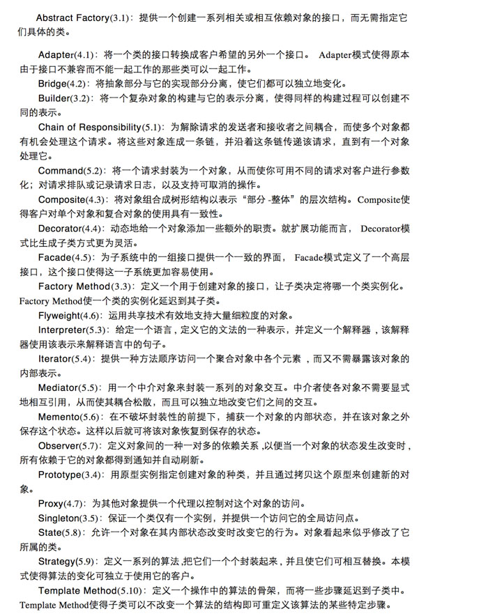

# 设计模式

https://refactoring.guru/

一个一个固定的应用场景。抽象，便于复用和维护。

**根据场景选择设计模式。**

在一定的环境下，用固定套路解决问题。

还可以自己去扩充。

业务流中场景符合哪种设计模式就选择哪种设计模式，有利于以后的维护。也可以不使用设计模式来实现，不利于维护。

设计模式：研究类和类之间的关系。

为类的创建和类的行为进行总结。

设计模式就是把简单的问题复杂化，标准化，软件规整化，维护起来更加的方便。

学习方法：背案例。

**面向抽象类编程**

抽象类	虚函数

抽象函数  多态

扩展方法：对类持有 然后增加方法。

# 面向对象编程：OOP(Object Oriented Programming)

面向对象的三大特征：

1. 封装 类里面有属性 有方法。

2. 继承 可以使用之前写的代码。

3. 多态 可以扩展 使用后来人写的代码。

   实现多态的3个条件：

   1. 要有继承
   2. 要有虚函数重写
   3. 父类引用，父类指针指向子类对象。

   多态的功能意义：

   多态可扩展机制比复用好的多。复用是别人已经写好的方法 继承。

   框架函数。不用改变。改变的是实现。

   框架已经提前写好了，实现是后来人写的，框架可以使用后来人写的代码。这就是可扩展。

C++多态 C语言指针，通过地址形参可以改变实参的值。

使用分类，拆分代码。单一功能的放到一个分类里面。

关联属性。

## 模式的应用场景

1. 创建型模式

   用来处理对象的创建过程 共5种

2. 结构型模式

   用来处理类或者对象的组合 共7种

3. 行为型模式

   用来对类或对象怎样交互和怎样分配职责进行描述 共11种

