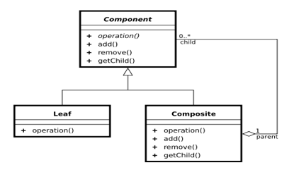

# 组合模式Composite

## 概念

Composite模式也叫组合模式，是构造型的设计模式之一。

通过递归手段来构造树形的对象结构，并可以通过一个对象来访问整个对象树。



#### Component （树形结构的节点抽象）

- 为所有的对象定义统一的接口（公共属性，行为等的定义）
- 提供管理子节点对象的接口方法
- [可选]提供管理父节点对象的接口方法

#### Leaf （树形结构的叶节点）

Component的实现子类

#### Composite（树形结构的枝节点）

Component的实现子类

### 适用于：

单个对象和组合对象的使用具有一致性。将对象组合成树形结构以表示“部分--整体”

单一对象（文件）和组合对象（文件夹）使用一致的接口

- 文件基类  抽象类。
  同一套接口。虚函数。
  - 显示节点的名字
  - 添加子节点
  - 删除子节点
  - 获取所有子节点
- 文件继承基类文件  （叶子节点）
  实现虚构函数  可以显示名字，不可以增加文件、删除文件、显示子目录，实现没有的功能的虚函数的时候直接返回-1 不做处理即可。
- 文件夹继承基类文件  （枝节点、目录节点） 
  实现虚构函数  可以显示名字和增删显示所有子目录。

目录里面放了很多东西，需要一个数组或者容器保存子节点。获取目录下所有子节点的时候，需要使用迭代器进行循环。

- IFile 抽象类 不管是叶子结点还是目录都用它。
  - 

```c++

#include <iostream>
using namespace std;
#include "list"
#include "string"

//
class IFile
{
public:
	virtual void display() = 0;
	virtual int add(IFile *ifile) = 0;
	virtual int remove(IFile *ifile) = 0;
	virtual list<IFile *>* getChild() = 0;
protected:
private:
};

class File : public IFile
{
public:
	File(string name)
	{
		m_list = NULL;
		m_name = "";
		m_name = name;
	}
	~File()
	{
		if (m_list != NULL)
		{
			delete m_list;
		}
	}
	virtual void display()
	{
		cout << m_name << endl;
	}
	virtual int add(IFile *ifile)
	{
		return -1;
	}
	virtual int remove(IFile *ifile)
	{
		return -1;
	}
	virtual list<IFile *>* getChild() 
	{
		return NULL;
	}

private:
	list<IFile *> *	m_list;
	string		m_name;

};

class Folder : public IFile
{
public:
	Folder(string name)
	{
		m_name = name;
		m_list = new list<IFile *>;
	}
	~Folder()
	{
		if (m_list == NULL)
		{
			delete m_list;
		}
	}
	virtual void display()
	{
		cout << m_name << endl;
	}
	virtual int add(IFile *ifile)
	{
		m_list->push_back(ifile);
		return 0;
	}
	virtual int remove(IFile *ifile)
	{
		m_list->remove(ifile);
		return 0;
	}
	virtual list<IFile *>* getChild() 
	{
		return m_list;
	}

private:
	list<IFile *> *	m_list;
	string			m_name;

};
//递归显示所有的节点
//1 显示跟 节点
//2 若根节点 有汉子
		//孩子是文件，显示名字
		//若孩子 是 目录 递归showTree(子目录)
void showTree(IFile *ifile, int level)
{
	list<IFile *> *l = NULL;
	int i = 0;
	for (i=0; i<level; i++)
	{
		printf("\t");
	}
	ifile->display();

	l = ifile->getChild();
	if (l != NULL)
	{
		for (list<IFile *>::iterator it=l->begin(); it!=l->end(); it++)
		{
			if ( (*it)->getChild() == NULL)
			{
				for (i=0; i<=level; i++) //注意 <= 
				{
					printf("\t");
				}
				(*it)->display();
			}
			else
			{
				showTree((*it), level + 1);
			}

		}
	}
}

void main()
{
	Folder *root = new Folder("C:");

	Folder *dir1 = new Folder("111dir");
	File *txt1 = new File("aaa.txt");

	Folder *dir12 = new Folder("222dir");
	//dir12->display();
	File *txt12 = new File("222.txt");
	//txt12->display();

	
	root->display();
	root->add(dir1);
	root->add(txt1);

	dir1->add(dir12);
	dir1->add(txt12);

	/*
	list<IFile *> *l = dir1->getChild();
	for (list<IFile *>::iterator it=l->begin(); it!=l->end(); it++)
	{
		(*it)->display();
	}
	*/
	//开发一个递归函数 现在根结点下的所有子结点
	cout << "测试递归函数" << endl;

	showTree(root, 0);

	delete txt12;
	delete dir12;
	delete dir1;
	delete txt1;
	delete root;
	cout<<"hello..."<<endl;
	system("pause");
	return ;
}
```

Teacher *t   指针  t指针
*t 获取指针t的值

组合模式

简单节点 复合节点 统一的用一个表示。

有复合对象有简单对象，统一的表示。