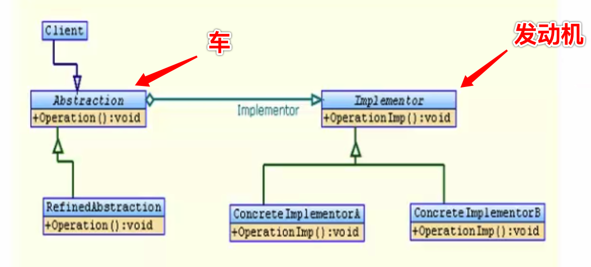

# 桥接模式Bridge

Bridge模式基于**类的最小设计原则**，通过使用封装，聚合以及继承等行为来让不同的类承担不同的责任。

**它的主要特点是把抽象（abstraction）与行为实现（implementation）分离开来，从而可以保持各部分的独立性以及应对它们的功能扩展。**

角色和职责

- Client

   Bridge模式的使用者

- Abstraction

    抽象类接口（接口或抽象类）维护对行为实现（Implementor）的引用

- Refined Abstraction

   Abstraction子类

- Implementor

    行为实现类接口 (Abstraction接口定义了基于Implementor接口的更高层次的操作)

- ConcreteImplementor

  Implementor子类

### 适用于

桥接模式（Bridge Pattern）是将抽象部分与实现部分分离（解耦合），使它们都可以独立的变化。

##### 例

车  安装  发动机 ：各种型号的车，车可以安装各种型号的发动机。车和发动机解耦合。

一个集合里面的元素和另一个集合里面的元素大量交叉，组合。多对多的关系。

图形  填  颜色 ： 各种各样的图形，各种各样的颜色。图形和颜色多对多关系。不同的图形上不同的颜色。

将“车  安装  发动机”这个抽象  和  实现进行分离；两个名字  就设计两个类；

将“图形  填  颜色”这个抽象  和  实现  进行分离，两个名字，就设计两个类

两个集合之间搭一个桥。两个事物连接起来。至少设计两个类。

车一个类，发动机一个类。

图形一个类，颜色一个类。

定义一个车，车持有发动机的引用。车的基类 发动机的基类。

车安装发动机，安装发动机不在车里面实现，

颜色是图形的成员变量。

把两个不同的事物分解开。 安装发动机不在车里面实现，发动机的安装是在发动机里面实现。

---

例

- 发动机 抽象类
  - 虚函数 安装发动机
- 具体发动机    发动机4400  发动机4500
  - 虚函数重写 安装发动机实现
- 车 抽象的车
  - 拥有一个发动机
  - 抽象函数 安装发动机 
- 具体的车 继承车    宝马5  宝马6 
  - 重写安装发动机 调用发动机安装方法

车和发动机随意组合。

宝马5可以安装发动机4400也可以安装发动机4500，宝马6可以安装发动机4400也可以安装4500。

多对多。两个类分离。

例：

- 抽象一个图形AbstractShape，
  - 含有操作draw（），可以画圆形、正方形
- 抽象一个颜色类color，
  - 含有getColor()：string

让AbstractShape持有一个color的引用。形成桥接模式。

创建类 	

Class Circle : public AbstractShape

Class Square : publice AbstractShape

创建类

Class Red : public color

Class Green : public color

测试： 用红色 画 正方形
Void main()
{
	Color color = new Red();
	AbstractShape *shap = new Square(color);
	shap.draw();

}