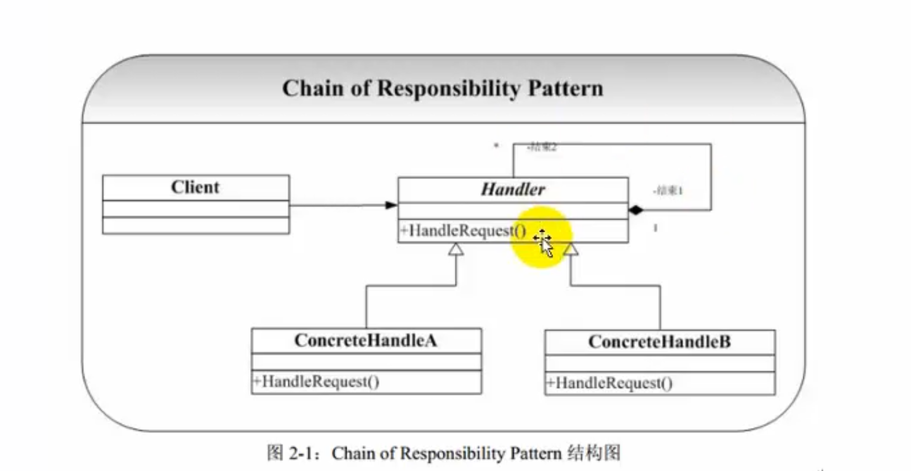

# 责任链模式Chain of Responsibility（CoR）

## 概念

Chain of Responsibility（CoR）模式也叫责任链模式或者职责连锁模式

该模式构造一系列分别担当不同的职责的类的对象来共同完成一个任务，这些类的对象之间像链条一样紧密相连，所以被称为责任链模式。

>例1:比如客户Client要完成一个任务，这个任务包括a，b，c，d四个部分。
>
>首先客户Client把任务交给A，A完成a部分之后，把任务交给B，B完成b部分，...，直到D完成d部分。
>
>例2:比如政府部分的某项工作，县政府先完成自己能处理的部分，不能处理的部分交给省政府，省政府再完成自己职责范围内的部分，不能处理的部分交给中央政府，中央政府最后完成该项工作。
>
>例3:软件窗口的消息传播
>
>例4:SERVLET容器的过滤器（Filter）框架实现。

## 角色和职责



1. Handler

   处理类的抽象父类

   Handler里面应持有一个指向自己类型的引用    类似链表

2. concreteHandler

   具体的处理类

A做完给B
B做完给C
C做完给D

## 责任链优缺点

##### 优点：

1. 责任的分担。每个类只需要处理自己该处理的工作（不该处理的传递给下一个对象完成），明确各类的责任范围，符合类的最小封装原则。
2. 可以根据需要自由组合工作流程。如工作流程发生变化，可以通过重新分配对象链便可适应新的工作流程。
3. 类与类之间可以以松耦合的形式加以组织。

##### 缺点：

因为处理时以链的形式在对象间传递消息，根据实现方式不同，有可能会影响处理的速度。

### 适用于：

​	链条式处理事情。工作流程化、消息处理流程化、事物流程化；

### 例

造车：造车头，车身，车尾。

客户端组织造车头，车身，车尾。顺序变了的话客户端需要修改代码 因为业务逻辑写死在了客户端，耦合高。这就需要责任链模式。

责任链模式 造完车之后，需要把任务传递下去。

造完车头之后，如果有任务就执行下一个任务（造车身）。造完车身之后 把任务移交给下一个处理者。

这样业务逻辑可以随便修改，造完车头可以造车身 也可以造完车头之后造车尾

```c++
#include <iostream>
using namespace std;
class CarHandle
{
public:
	virtual void HandleCar() = 0;
	
public:
	CarHandle *setNextHandle(CarHandle *carhandle)
	{
		this->carhandle = carhandle;
		return this->carhandle;
	}
protected:
	CarHandle *carhandle;
};

class CarHandleHead : public CarHandle
{
public:
	virtual void HandleCar()
	{
		cout << "处理车头" << endl;
		if (this->carhandle != NULL)
		{
			carhandle->HandleCar();
		}
	}
};

class CarHandleBody : public CarHandle
{
public:
	virtual void HandleCar()
	{
		cout << "处理车身" << endl;
		if (this->carhandle != NULL)
		{
			carhandle->HandleCar();
		}
	}
};

class CarHandleTail : public CarHandle
{
public:
	virtual void HandleCar()
	{
		cout << "处理车尾" << endl;
		if (this->carhandle != NULL)
		{
			carhandle->HandleCar();
		}
	}
};

void main()
{
	CarHandleHead *head = new CarHandleHead;
	CarHandleBody *body = new CarHandleBody;
	CarHandleTail *tail = new CarHandleTail;

	head->setNextHandle(body);
	body->setNextHandle(tail);
	tail->setNextHandle(NULL);

	//处理
	head->HandleCar();
	delete head;
	delete body;
	delete tail;
	system("pause");
	return ;
}
```

## 总结

要想传递下去，需要有一个指向自己类型的引用。类似链表。这样才能向下传递。

任务里面持有下一个任务。直到下一个任务为空则停止。