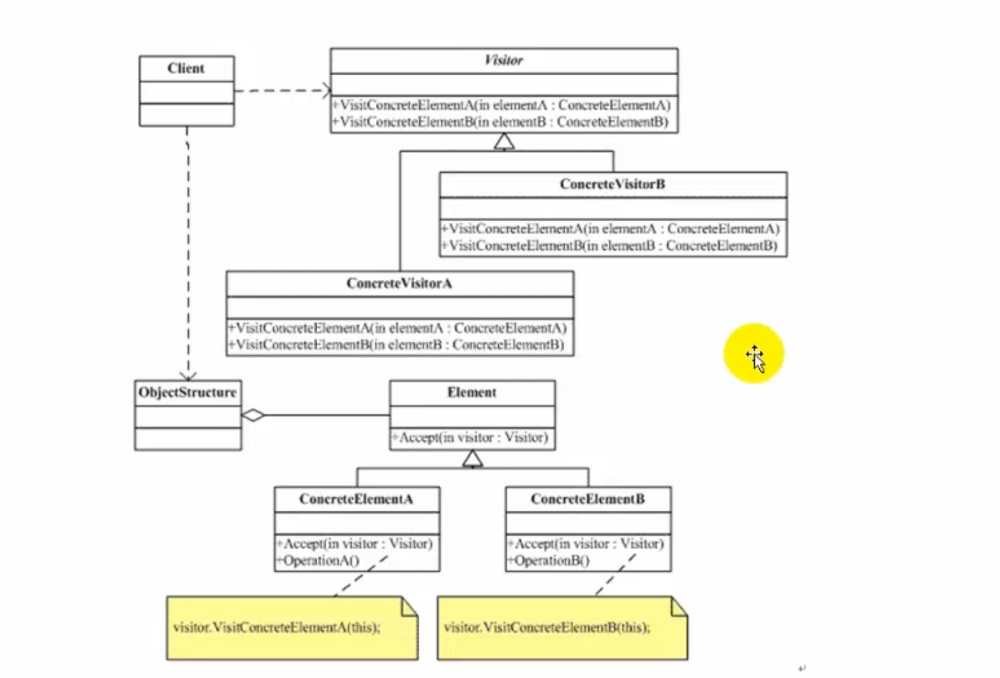
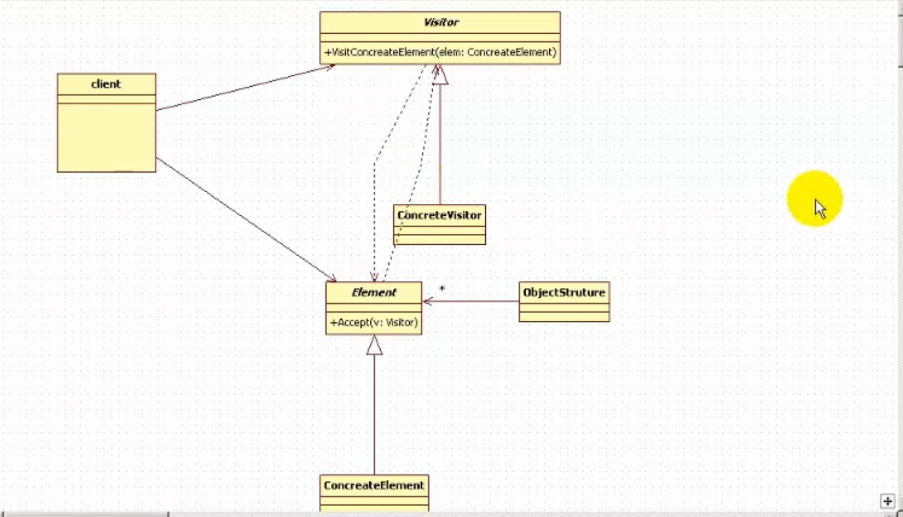

# 访问者模式

## 概念

Visitor模式也叫访问者模式，是行为模式之一。

它分离对象的数据和行为（对象的属性和行为进行分离），使用Visitor模式，可以不修改已有类的情况下，增加新的操作角色和职责。

访问者模式解决别人怎么访问的。

## 角色和职责



访问者模式
不同的操作访问数据结构的各个部分
就是元素属性和不同的操作解耦合

### 例

公园中很多地方A B C
有访问者X Y Z 访问者可以去打扫A B C 可以是参观A B C  等不同的操作。

元素中有抽象的访问者
访问者中也拥有元素的引用

客户拥有很多元素和访问者

客户端Client和访问者Visitor的解耦合。

公园和访问者之间的关系：公园接受所有的访问者访问，所以公园有一个函数接受访问者的访问Element中有一个Accept方法参数是Visitor。

访问者对公园的某一部分做操作，所以Visitor也有一个element的引用。访问者访问公园的时候，访问方法里面有一个公园的参数。

公园接收访问者访问，也有一个访问者参数。



客户Client可以new很多访问者，可以new一个公园。公园接收访问者访问，访问者可以访问公园。

- 抽象访问者（Visitor）角色

  声明了一个或者多个访问操作，形成所有的具体元素角色必须实现的接口。

- 具体访问者（ConcreteVisitor）角色

  实现抽象访问者角色所声明的接口，也就是抽象访问者所声明的各个访问操作。

- 抽象节点（Element）角色

  声明一个接受操作，接受一个访问者对象作为一个参量。

- 具体节点（ConcreteElement）角色

  实现了抽象元素所规定的接受操作。

- 结构对象（ObiectStructure）角色 （相当于整个公园。里面包括很多公园的小部分，是一个集合）

  有如下的一些责任：
  
  可以遍历结构中的所有元素；
  
  ​	如果需要，提供一个高层次的接口让访问者对象可以访问每一个元素；
  
  ​	如果需要，可以设计成一个复合对象或者一个聚集，如列（List）或集合（Set）。

抽象的访问者 可以访问公园

抽象的公园元素（公园的每一个部分）

具体的公园 A部分，公园B部分

公园A部分接收访问者，参数是访问者，调用访问者执行动作，调用访问者执行动作时把公园传给了访问者。公园和访问者之间是来回传递的过程。

访问者访问公园，具体的访问者A访问公园做打扫工作，访问者B访问公园做检查工作。

## 适用于

把数据结构 和 作用于数据结构上的操作 进行解耦合;

适用于数据结构比较稳定的场合

## 访问者模式总结：

- 访问者模式优点是增加新的操作很容易，因为增加新的操作就意味着增加一个新的访问者。访问者模式将有关的行为集中到一个访问者对象中。
- 访问者模式的缺点是增加新的数据结构变得困难了

元素接收访问者的访问 方法 参数是访问者的抽象类，然后调用访问者去做事

元素和访问者是相互传递的关系

访问者访问公园的某一部分
公园的某一部分接受访问者的访问。

### 高级

访问者不只可以访问公园的一部分，还可以访问整个公园。使用集合，公园的每一部分在这个集合里面。

创建一个整个公园的类， 里面有一个包含所有公园元素的集合

一个访问者可以访问公园的所有部分。访问的时候，使用迭代器访问公园所有部分。

#### 案例

案例需求：
比如有一个公园，有一到多个不同的组成部分；该公园存在多个访问者：清洁工A负责打扫公园的A部分，清洁工B负责打扫公园的B部分，公园的管理者负责检点各项事务是否完成，上级领导可以视察公园等等。也就是说，对于同一个公园，不同的访问者有不同的行为操作（清洁工是打扫卫生，领导来视察，小学生来做义工），而且访问者的种类也可能需要根据时间的推移而变化（行为的扩展性）。

根据软件设计的开闭原则（对修改关闭，对扩展开放），我们怎么样实现这种需求呢？

```c++
#include <iostream>
using namespace std;
#include "list"
#include "string"

class  ParkElement;
 
//不同的访问者 访问公园完成不同的动作 
class Visitor
{
public:
	virtual void visit(ParkElement *park) = 0;
};

class ParkElement //每一个
{
public:
	virtual void accept(Visitor *v) = 0;
};

class ParkA : public ParkElement
{
public:
	virtual void accept(Visitor *v)
	{
		v->visit(this);
	}
};

class ParkB : public ParkElement
{
public:
	virtual void accept(Visitor *v)
	{
		v->visit(this);
	}
};

//访问整个公园 所有的地方
class Park  : public ParkElement
{
public:
	Park()
	{
		m_list.clear();
	}
	void setPart(ParkElement *e)
	{
		m_list.push_back(e);
	}
public:
	void accept(Visitor *v)
	{
		for (list<ParkElement *>::iterator it=m_list.begin(); it != m_list.end(); it++)
		{
			(*it)->accept(v);
		}
	}

private:
	list<ParkElement *> m_list;
};

class VisitorA : public Visitor
{
public:
	virtual void visit(ParkElement *park)
	{
		cout << "清洁工A访问公园A部分，打扫卫生完毕" << endl;
	}
};

class VisitorB : public Visitor
{
public:
	virtual void visit(ParkElement *park)
	{
		cout << "清洁工B 访问 公园B 部分，打扫卫生完毕" << endl;	
	}
};
class VisitorManager : public Visitor
{
public:
	virtual void visit(ParkElement *park)
	{
		cout << "管理员 检查整个公园卫生打扫情况" << endl;
	}
};

void main()
{
	VisitorA *visitorA = new VisitorA;
	VisitorB *visitorB = new VisitorB;
	
	ParkA *partA = new ParkA;
	ParkB *partB = new ParkB;

	//公园接受访问者a访问
//基础的 一个访问者访问公园某一个地方
	partA->accept(visitorA);
	partB->accept(visitorB);

//高级的 一个访问者 访问整个公园（几个地方）
	VisitorManager *visitorManager = new VisitorManager;
	Park * park = new Park;
	park->setPart(partA);
	park->setPart(partB);
	park->accept(visitorManager);

	cout<<"hello..."<<endl;
	system("pause");
	return ;
}
```

访问者和公园元素之间是相互传递。多公园元素和多个访问者，多对多。

不同的动作访问数据结构的不同的部分。

增加新的访问者，不影响之前的，符合开闭原则。

