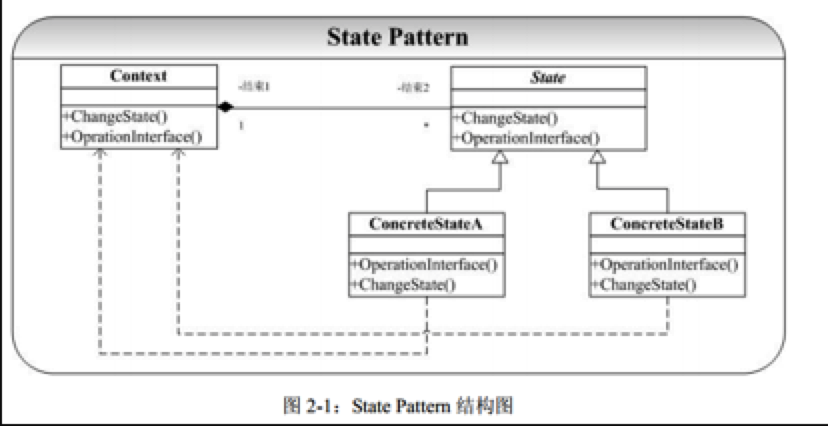

# 状态模式

## 概念

State模式也叫状态模式，是行为设计模式的一种。

State模式允许通过改变对象的内部状态而改变对象的行为，这个对象表现得就好像修改了它的类一样。 

状态模式主要解决的是当控制一个对象状态转换的条件表达式过于复杂时的情况。把状态的判断逻辑转译到表现不同状态的一系列类当中，可以把复杂的判断逻辑简化。

## 问题

​	每个人、事物在不同的状态下会有不同表现（动作），而一个状态又会在不同的表现下转移到下一个不同的状态（State）。

​	最简单的一个生活中的例子就是：地铁入口处，如果你放入正确的地铁票，门就会打开让你通过。在出口处也是验票，如果正确你就可以ok，否则就不让你通过（如果你动作野蛮，或许会有报警（Alarm））。

​	有限状态自动机（FSM）也是一个典型的状态不同，对输入有不同的响应（状态转移）。通常我们在实现这类系统会使用到很多的SwitchCase语句，Case某种状态，发生什么动作。Case另外一种状态，则发生另外一种动作。但是这种实现方式至少有以下两个问题：

1. 当状态数目不是很多的时候，SwitchCase可能可以搞定。但是当状态数目很多的时候（实际系统中也正是如此），维护一大组的SwitchCase语句将是一件异常困难并且容易出错的事情。

 	2. 状态逻辑和动作实现没有分离。在很多的系统实现中，动作的实现代码直接写在状态的逻辑当中。这带来的后果就是系统的扩展性和维护性得不到保证。

## 模式选择

State模式就是被用来解决上面列出的两个问题的，在State模式中我们将状态逻辑和动作实现进行分离，当一个操作中要维护大量的case分支语句，并且这些分支依赖于对象的状态，State模式将每一个分支都封装到独立的类中。

##### State模式典型的结构图为：



## 角色和职责

- Context：用户对象
  拥有一个State类型的成员，以标识对象的当前状态； 
- State：接口或基类
  封装与Context的特定状态相关的行为； 
- ConcreteState：接口实现类或子类
  实现了一个与Context某个状态相关的行为。 

## 适用于

​	对象的行为，依赖于它所处的当前状态。行为随状态改变而改变的场景。
**适用于：通过用户的状态来改变对象的行为。**

不同状态不同行为。
主要解决Swithc/Case比较多的情况，不止一两种。如果把状态和动作的实现代码在一起，很难去扩展和维护。傻傻分不清。

### 例

context相当于员工 

员工有很多的状态：

- 七点到八点               吃早饭
- 九点到十二点           上班 
- 十二点到十四点        应该休息。

传不同的时间状态，做不同的事情。传7吃早饭，传9上班，传12休息。

context有很多状态，总有一个当前状态。例：电视可以选择CCTV1，CCTV2，选哪个就播放那个，总有一个在播放的频道。

难点：
由吃饭状态改为上班状态， 在状态里面完成转化。删除当前状态，创建新的状态。新的 状态设为当前状态，然后获取当前状态去做动作。

由状态1转到状态2是一个难点。

### 代码实现：

worker是员工

setHour是改变状态

具体的动作实现，是在具体的state中实现的。


```c++

#include <iostream>
using namespace std;

class Worker;

class State
{
public:
	virtual void doSomeThing(Worker *w) = 0;
};

class Worker  
{
public:
	Worker();
	int getHour()
	{
		return m_hour;
	}
	void setHour(int hour)
	{
		m_hour = hour;
	}
	State* getCurrentState()
	{
		return m_currstate;
	}
	void setCurrentState(State* state)
	{
		m_currstate = state;
	}

	void doSomeThing() //
	{
		m_currstate->doSomeThing(this);
	}
private:
	int		m_hour;
	State	*m_currstate; //对象的当前状态
};

class State1 : public State
{
public:
	 void doSomeThing(Worker *w);
};

class State2  : public State
{
public:
	 void doSomeThing(Worker *w);
};

void State1::doSomeThing(Worker *w)
{
	if (w->getHour() == 7 || w->getHour()==8)
	{
		cout << "吃早饭" << endl; 
	}
	else
	{ 
		delete w->getCurrentState();  //状态1 不满足 要转到状态2
		w->setCurrentState(new State2 );
		w->getCurrentState()->doSomeThing(w); //
	}
}


void State2::doSomeThing(Worker *w)
{
	if (w->getHour() == 9 || w->getHour()==10)
	{
		cout << "工作" << endl; 
	}
	else 
	{
		delete w->getCurrentState(); //状态2 不满足 要转到状态3 后者恢复到初始化状态
		w->setCurrentState(new State1); //恢复到当初状态
		cout << "当前时间点：" << w->getHour() << "未知状态" << endl;
	}
}

Worker::Worker()
{
	m_currstate = new State1;
}

void main()
{
	Worker *w1 = new Worker;
	w1->setHour(7);
	w1->doSomeThing();

	w1->setHour(9);
	w1->doSomeThing();

	delete w1;
	cout<<"hello..."<<endl;
	system("pause");
	return ;
}
```