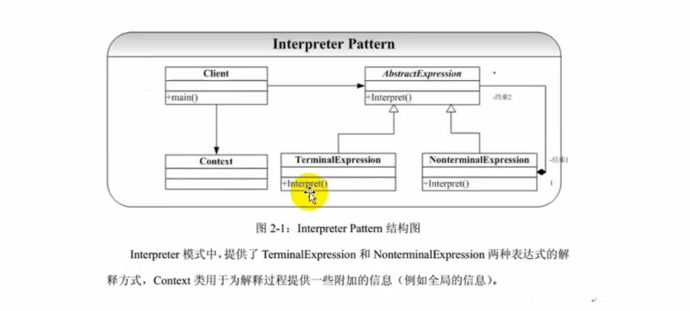
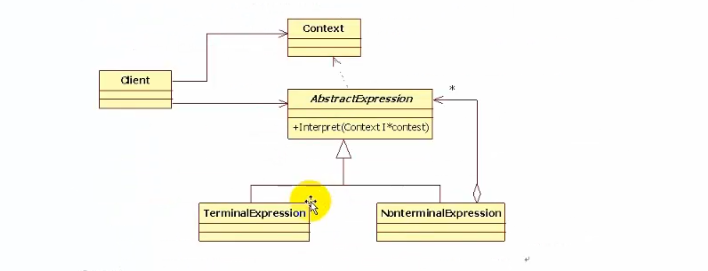

# 解释器模式

## 概念

​	一些应用提供了内建（Build-In）的脚本或者宏语言来让用户可以定义他们能够在系统中进行的操作。Interpreter模式的目的就是使用一个解释器为用户提供一个一门定义语言的语法表示的解释器。然后通过这个解释器来解释语言中的句子。

​	Interpreter模式提供了这样的一个实现语法解释器的框架，笔者（不是本人）曾经也正在构建一个编译系统Visual CMCS，现在已经发布了Visual CMCS1.0（Beta），请大家访问Visual CMCS网站获取详细信息。

​	输入一个a解释成一个动作，输入一个b解释成另一个动作。

## 角色和职责






- Context

  解释器上下文环境类。用来存储解释器的上下文环境，比如需要解释的文法等。 

  上下文就是存储一些信息。记录中间结果和中间状态。

- AbstractExpression   
  解释器抽象类。

- ConcreteExpression
  解释器具体实现类。

一个context
多个解释器
加法解释器，减法解释器，乘法解释器等等。
使用不同的解释器 解释上下文得到不同的结果。

### 例：

加法。 context包含输入的数和运算的结果

```c++

#include <iostream>
using namespace std;
#include "string"

class Context
{
public:
	Context(int num)
	{
		m_num = num;
	}
public:
	void setNum(int num)
	{
		m_num = num;
	}
	int getNum()
	{
		return m_num;
	}
	void setRes(int res)
	{
		m_res = res;
	}
	int getRes()
	{
		return m_res;
	}

private:
	int m_num;
	int m_res;

};

class Expression
{
public:
	virtual void interpreter(Context *context) = 0;
};

class PlusExpression : public Expression
{
public:
	virtual void interpreter(Context *context)
	{
		int num = context->getNum();
		num ++ ;
		context->setNum(num);
		context->setRes(num);
	}
};

class MinusExpression : public Expression
{
public:
	virtual void interpreter(Context *context)
	{
		int num = context->getNum();
		num -- ;
		context->setNum(num);
		context->setRes(num);
	}
};

void main()
{
	Context *pcxt = new Context(10);
	Expression *e1 = new PlusExpression;
	e1->interpreter(pcxt);
	cout << "PlusExpression:" << pcxt->getRes() << endl;

	Expression *e2 = new MinusExpression;
	e2->interpreter(pcxt);
	cout << "MinusExpression:" << pcxt->getRes() << endl;

	delete e2;
	delete e1;
	system("pause");
	return ;
}
```

要修改的数据和运算的结果都在context中。