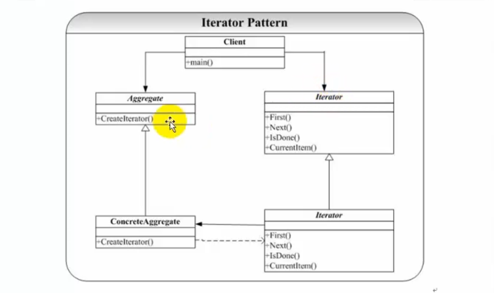

# 迭代器模式

## 概念

Iterator模式也叫迭代模式，是行为模式之一。

它把对容器中包含的内部对象的访问委让给外部类，使用Iterator（遍历）按顺序进行遍历访问的设计模式。

在应用Iterator模式之前，首先应该明白Iterator模式用来解决什么问题。或者说，如果不使用Iterator模式，会存在什么问题。

1. 由容器自己实现顺序遍历。直接在容器类里直接添加顺序遍历方法 
2. 让调用者自己实现遍历。直接暴露数据细节给外部。

以上`方法1`与`方法2`都可以实现对遍历，这样有问题呢？

1. 容器类承担了太多功能：一方面需要提供添加删除等本身应有的功能；一方面还需要提供遍历访问功能。
2. 往往容器在实现遍历的过程中，需要保存遍历状态，当跟元素的添加删除等功能夹杂在一起，很容易引起混乱和程序运行错误等。

Iterator模式就是为了有效地处理按顺序进行遍历访问的一种设计模式，简单地说，Iterator模式提供一种有效的方法，可以屏蔽聚集对象集合的容器类的实现细节，而能对容器内包含的对象元素按顺序进行有效的遍历访问。所以，Iterator模式的应用场景可以归纳为满足以下几个条件：
- 访问容器中包含的内部对象 
- 按顺序访问

## 角色和职责

GOOD：提供一种方法顺序访问一个聚敛对象的各个元素，而又不暴露该对象的内部表示。
为遍历不同的聚集结构提供如开始，下一个，是否结束，当前一项等统一接口。



客户端new一个抽象的集合Aggregate，new一个抽象的迭代器Iterator。

为什么迭代器可以访问各种各样的容器：

首先容器创建了一个迭代器，CreateIterator接口返回一个迭代器。然后把容器的指针扔给迭代器，迭代器拥有了一个指向具体容器的引用，迭代器就可以访问容器。

数组集合创建一个迭代器，创建迭代器然后把自身this传给这个迭代器。迭代器就可以通过这个this指针访问集合，相当于迭代器拥有了一个集合的引用（指针）。然后就可以遍历集合。

迭代器和集合 一来一回，就可以访问。

- Iterator（迭代器接口）：
  该接口必须定义实现迭代功能的最小定义方法集
  比如提供hasNext()和next()方法。
- ConcreteIterator（迭代器实现类）：
  迭代器接口Iterator的实现类。可以根据具体情况加以实现。
- Aggregate（容器接口）：
  定义基本功能以及提供类似Iterator iterator()的方法。
- concreteAggregate（容器实现类）：
  容器接口的实现类。必须实现Iterator iterator()方法。


##### 在迭代器中 持有 一个集合的 引用；所以通过迭代器，就可以访问集合 `


## 遍历容器

可以访问各种各样的容器

容器创建了迭代器  其中把容器自己的指针扔给了迭代器。
相当于：迭代器拥有了一个集合的指针引用。
所以通过这个指针可以访问这个集合。

for循环就可以根据迭代器 遍历容器

迭代器抽象层

```c++
typedef int Object;
```

```c++
virtual  void  First() = 0; //指向第一个
virtual  void  Next() = 0;//向下移一个
virtual  void  IsDone() = 0;//是否结束
virtual  Object  CurrentItem() = 0; //获取迭代器当前所指元素
```

抽象集合
```c++
virtual  MyIterator *CreateIterator() = 0;
virtual  Object getItem(int index) = 0;//迭代器根据下标获取集合元素
virtual  int getSize() = 0;//get集合的大小
```

先创建集合Aggregate对象ag
再创建迭代器 根据ag去创建迭代器

集合里面创建迭代器  创建迭代器的时候把自身this指针传进去扔给迭代器。迭代器拥有了集合的指针。迭代器就可以访问集合。

通过迭代器里的指针找到集合，访问集合。

迭代器被谁创建了 就持有谁的引用。

例：
```c++

#include <iostream>
using namespace std;

typedef int Object ;
#define SIZE 5 

//注意类的顺序 
class MyIterator
{
public:
	virtual void First() = 0;
	virtual void Next() = 0;
	virtual bool IsDone() = 0;
	virtual Object CurrentItem() = 0;
};

class Aggregate
{
public:
	virtual Object getItem(int index) = 0;
	virtual MyIterator *CreateIterator() = 0;
	virtual int getSize() = 0;
};

class ContreteIterator : public MyIterator
{
public:
	ContreteIterator(Aggregate *ag) 
	{
		_ag = ag;
		_idx = 0;
	}
	~ContreteIterator()
	{
		_ag = NULL;
		_idx = 0;
	}

	virtual void First()
	{
		_idx = 0;
	}
	virtual void Next()
	{
		if (_idx <	_ag->getSize())
		{
			_idx ++;
		}
	}
	virtual bool IsDone()
	{
		return (_idx == _ag->getSize());
	}
	virtual Object CurrentItem()
	{
		return _ag->getItem(_idx);
	}

protected:
private:
	int			_idx;
	Aggregate	*_ag;
};

class ConcreteAggregate : public Aggregate
{
public:
	ConcreteAggregate()
	{
		for (int i=0; i<SIZE; i++)
		{
			object[i] = i+1;
		}
	}
	virtual ~ConcreteAggregate()
	{

	}
	virtual Object getItem(int index)
	{
		return object[index];
	}
	virtual MyIterator *CreateIterator()
	{
		return new ContreteIterator(this);
	}
	virtual int getSize()
	{
		return SIZE;
	}
protected:
private:
	Object object[SIZE];
};

void main21()
{
	// 创建一个集合
	Aggregate *ag = new ConcreteAggregate();
	// 创建一个遍历这个集合的 迭代器
	MyIterator *it = ag->CreateIterator();
	

	//通过迭代器 遍历 集合
	for (; !(it->IsDone()); it->Next() )
	{
		cout << it->CurrentItem() << " ";
	}
	
	//清理相关资源 
	delete it;
	delete ag;
}

void main()
{
	main21();
	system("pause");
	return ;
}
```

#### 总结

遍历容器的统一的访问接口和统一方法，

STL容器算法迭代器设计理念。

提供了方法统一的访问各种各样的容器。

迭代器：

迭代器里面应该设计一个_currentIndex记录当前的位置。

迭代器里还要有一个访问的集合的指针。接收集合创建迭代器传进来的集合自身指针。


迭代器持有集合的引用。迭代器被谁创建 就持有谁的引用。