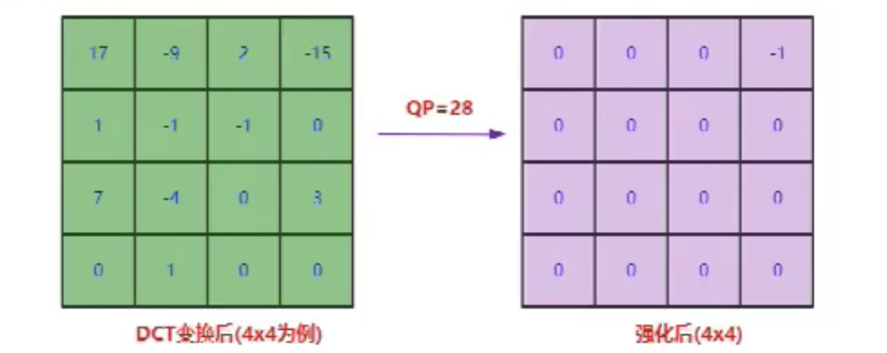

# H264

## H264数据结构

视频由视频帧组成。图像达到一秒16帧以上就认为是视频。

在网络传输时图片很大，一次传输不了一整张图片，每一个图片可以分成很多片，片有片头（网络传输序号）和片数据。

每一片有很多一个宏块。宏块包括：宏块类型、宏块预测、残差数据。

宏块又可以分成子块。

宏块是H264编码的基本单位。每个宏块选择合适的预测模式。

编码完成后会得到一个一个的流单元NALU（SPS、PPS、I Frame、P Frame、B Frame）。

## 码流数据单元NALU

NALU从十六进制转为二进制

- 第1位`forbidden_zero_bit` ：禁止位，初始为0，当网络发现NAL单元有比特错误时可设置该比特为1，以便接收方纠错或丢掉该单元。
- 第2到3位`nal_ref_idc`：重要级别，取00~11。00重要级别低，11重要级别高
- 第4到8位`nal_unit_type`：流nal单元类型

H.264原始码流(裸流)是由一个接一个NALU组成，它的功能分为两层：

1. 视频编码层（VCL）：包括核心压缩引擎和块，宏块和片的语法级别定义，设计目标是尽可能地独立于网络进行高效的编码。
2. 网络提取层（NAL）：负责将VCL产生的比特字符串适配到各种各样的网络和多元环境中，覆盖了所有片级以上的语法级别。

在VCL进行数据传输或存储之前，这些编码的VCL数据，被映射或封装进NAL单元（NALU）。

### H.264 NALU结构：

1. `StartCode`

    标示这是一个NALU 单元的开始，必须是`"00 00 00 01`" 或`"00 00 01"`开头。

2. 切片

    1. 切片头`NALU Header`

       一组对应于视频编码的NALU头部信息

    2. 切片数据`RBSP`

       一个原始字节序列负荷(RBSP,Raw Byte Sequence Payload)

H264中的都是NALU数据，一帧图片经过 H.264 编码器编码之后，就被编码为一个或多个片（slice），而装载着这些片（slice）的载体，就是`NALU`。

下面分析一下H264的编码原理：

## 宏块划分

当每一帧图像被送到 H264 编码器的缓冲区中。编码器先要为每一幅图片划分宏块。

对于每一帧图像，是划分为一个个宏块块进行编码。

宏块大小

- 16x16（H264、VP8）
- 32x32（H265、VP9）
- 64x64（H265、VP9、AV1）
- 128x128（AV1）

以下面这张图为例

H264默认是使用 `16X16` 大小的区域作为一个宏块，也可以划分成更小的 `8X8`的大小。

宏块划分好了之后，就会计算宏块内的像素值

依次循环划分，等到将一帧图像宏块划分和像素计算完毕后就是这样子的：

## 划分子块

H264对比较平坦的图像使用 `16X16` 大小的宏块。为了更高的压缩率，还可以在 `16X16` 的宏块上更划分出更小的子块。

子块的大小可以是 `8X16`､ `16X8`､ `8X8`､ `4X8`､ `8X4`､ `4X4`非常的灵活。

## 帧分组GOF(Group of Frame)

宏块划分好后，就可以对H264编码器缓存中的所有图片进行分组了。

视频的压缩原理就是去掉冗余数据，视频的冗余数据主要是时间冗余和空间冗余。

我们通过摄像头每秒中抓取几十帧的画像，而这些画像大部分情况下都是有相关性的，这些关联特别密切的帧，只需要保存一帧的数据，其它帧都可以通过这一帧按某种规则预测出来，所以说视频数据在**时间上的冗余是最多的**。这也是为什么会有I帧、P帧以及B帧的缘由。

### 一组帧GOF

 一个I帧到下一个I帧.这一组的数据.包括B帧/P帧.称为GOF.

为了达到通过某几帧图像来预测后面几帧图像的目的，需要对帧进行分组，将一些相似的帧划分在一组。

如果在一秒钟内有30帧，这30帧可以画成一组。如果摄像机或者镜头它一分钟之内它都没有发生大的变化，那也可以把这一分钟内所有的帧画做一组。

### GOP长度

GOP太长：如果I帧数据异常，这个group显示都有问题，导致画面长时间异常。拖动播放：10s为一组的话，想要拖动到5s就很麻烦。

GOP太短：码率就会上升，I帧太多。

一般1秒或2秒设置一个GOP。

如何判定某些帧关系密切，可以划为一组呢？看一下例子，下面是捕获的一组运动的台球的视频帧，台球从右上角滚到了左下角。

H264编码器会按顺序，每次取出两幅相邻的帧进行宏块比较，计算两帧的相似度，如图：

通过宏块扫描与宏块搜索如果发现这两个帧的关联度是非常高的，那么这几帧就可以划分为一组。

#### 分组算法

在相邻几幅图像画面中，一般有差别的像素只有10%以内的点、亮度差值变化不超过2%、色度差值的变化只有1%以内，我们认为这样的图可以分到一组。

在这样一组帧中，经过编码后，只保留第一帧的完整数据，其它帧都通过参考上一帧计算出来。我们称第一帧为IDR／I帧，其它帧称为P／B帧，这样编码后的数据帧组称为GOP。

### I帧: 关键帧,帧内压缩技术.

保留了一张完整视频帧，解码关键。

摄像机一般一秒钟会抓取几十帧的数据。比如像动画，就是25帧/s，一般视频文件都是在30帧/s左右。对于一些要求比较高，对动作的精细度有要求，想要捕捉到完整的动作的，高级的摄像机一般是60帧/s。那些对于一组帧的它的变化很小。为了便于压缩数据，将第一帧完整的保存下来，如果没有这个关键帧后面解码数据是完成不了的，所以I帧特别关键。

### P帧: 向前参考帧.压缩时只参考前一个帧.帧间压缩技术.

保存和前一帧图片不同的数据，如果一样就不保存。

向前参考帧，差异数据，解码需要依赖I帧

- 视频的第一帧会被作为关键帧完整保存下来.而后面的帧会向前依赖.也就是第二帧依赖于第一个帧.后面所有的帧只存储于前一帧的差异.这样就能将数据大大的减少.从而达到一个高压缩率的效果.

### B帧: 双向参考帧,压缩时即参考前一帧也参考后一帧.帧间压缩技术.

相同的数据。向前向后（双向）参考帧，编解码延迟，保存更少的数据。

- B帧：即参考前一帧也参考后一帧，使得它的压缩率更高，存储的数据量更小。

  优点；B帧的数量越多，压缩率就越高.

  缺点；如果是实时互动的直播，B帧要参考后面的帧才能解码，在网络中就要等待后面的帧传输过来。如果网络状态很好的话，解码会比较快，如果网络不好时解码会稍微慢一些，丢包时还需要重传。对实时互动的直播，需要提高时效性，一般不会使用B帧。

  泛型娱乐对实时性要求不高，可以接受一定度的延时，需要比较高的压缩比就可以使用B帧。

### 顺序

发送顺序：I1	P3	B2

解码顺序：I1	P3	B2

读取顺序：I1			B2	P3

显示顺序：按照原是图像顺序显示

### SPS/PPS

SPS/PPS实际上就是存储GOP的参数。

#### SPS: (Sequence Parameter Set,序列参数集)

存放帧数、参考帧数目、解码图像尺寸、帧场编码模式选择标识等。一组帧的参数集。

#### PPS:(Picture Parameter Set,图像参数集)

存放熵编码模式选择标识、片组数目、初始量化参数和去方块滤波系数调整标识等(与图像相关的信息)。

在一组帧之前我们首先收到的是SPS/PPS数据，如果没有这组参数的话是无法解码。

在解码时发生错误，首先要检查是否有SPS/PPS，如果没有，是因为对端没有发送过来还是因为对端在发送过程中丢失了。

SPS/PPS数据，我们也把其归类到I帧，这2组数据是绝对不能丢的。

**VideoToolBox硬编码H264帧（I帧），手动添加了SPS和PPS。所以解码时需要使用SPS/PPS数据来对解码器进行初始化。**

### 视频花屏/卡顿原因

观看视频时，遇到花屏或者卡顿现象，与GOF相关。

- 如果GOP分组中的P帧丢失就会造成解码端的图像发生错误。
- 如果H264码流中I帧错误或者丢失，P帧B帧单独是完成不了解码工作，解码错误会产生花屏现象。
- 为了避免花屏问题的发生，一般如果发现P帧或者I帧丢失，就不显示本GOP内的所有帧，只到下一个I帧来后重新刷新图像。因为没有刷新屏幕，丢包的这一组帧全部扔掉了，图像就会卡在哪里不动，这就是卡顿的原因。

**总结：花屏是因为丢了P帧或者I帧，导致解码错误。而卡顿是因为为了怕花屏，将整组错误的GOP数据扔掉了，直达下一组正确的GOP再重新刷屏，而这中间的时间差，就是所感受的卡顿。**

## H264编码

H.264是在MPEG-4技术的基础之上建立起来的，其编解码流程主要包括5个部分：

1. 帧间和帧内预测（Estimation）
2. 变换（Transform）和反变换
3. 量化（Quantization）和反量化
4. 环路滤波（Loop Filter）
5. 熵编码（Entropy Coding）

## 数据冗余

**任何视频/音频的压缩都是针对冗余数据的压缩。**只要接收端不会产生误解，就可以减少承载信息的数据量。

### 1、时间冗余

视频序列的相邻前后帧图像之间内容相似，比如帧率25fps的视频中前后两帧图像相差之后40ms，前后两张图像的变化比较小，相似性很高。

### 2、空间冗余

图像相邻像素之间有较强的相关性，比如一帧图像划分多个16x16的块之后，相邻的块有很多比较明显的相似性。

### 3、视觉冗余

我们的眼睛对某些细节不敏感，对图像中的高频信息的敏感度小于低频信息。可以去除图像中的一些高频信息，人眼看起来跟不去除高频信息差别不大（有损压缩）。

### 4、编码冗余（信息熵冗余）

一副图像中不同像素出现的概率是不同的，对出现次数比较多的像素，用少的位数来编码，对出现次数比较少的像素，用多的位数来编码，能够减少编码的大小。比如哈夫曼编码。

## H264的四种方法压缩技术

### 1、帧间预测压缩，解决的是时域冗余问题

摄像头在一段时间内所捕捉的数据没有较大变化，针对这**一时间内的相同数据压缩掉**，就叫时域数据压缩。

#### 运动估计与补偿

我们把**运动估计与补偿称**为帧间压缩技术，它解决的是视频帧在时间上的数据冗余。

在H264编码器中将帧分组后，就要计算帧组内物体的运动矢量了。

H264编码器首先按顺序从缓冲区头部取出两帧视频数据，然后进行宏块扫描。当发现其中一幅图片中有物体时，就在另一幅图的邻近位置（搜索窗口中）进行搜索。
如果此时在另一幅图中找到该物体，那么就可以计算出物体的运动矢量了。

以台球的例子为例，下面这幅图就是搜索后的台球移动的位置。

通过两帧图像中台球位置相差，就可以计算出台球运行的方向和距离。H264依次把每一帧中球移动的距离和方向都记录下来就成了下面的样子：

运动矢量计算出来后，将相同部分（也就是绿色部分）减去，就得到了**补偿数据**。

最终只需要将补偿数据进行压缩保存，以后在解码时就可以恢复原图了。压缩补偿后的数据只需要记录很少的一点数据，因而达到了压缩的目的。

### 2、帧内预测压缩，解决的是空域数据冗余问题

帧内预测压缩，解决的是空域数据冗余问题。

什么是空域数据：就是这幅图里数据在宽高空间内包含了很多颜色、光亮，**人的肉眼很难察觉的数据**，对于这些数据，我们可以认作冗余，直接压缩掉。有损压缩。

**人眼对图象都有一个识别度，对低频的亮度很敏感，对高频的亮度不太敏感**。所以基于一些研究，可以将一幅图像中人眼不敏感的数据去除掉。这样就提出了帧内预测技术。

运动补偿解决的是视频数据在时间上的冗余问题，帧内预测压缩解决的是视频数据在空间上的冗余问题。

#### 预测模式

H264编码器在对一幅图像被划分好宏块后，对每个宏块可以进行各种模式的预测。找出与原图最接近的一种预测模式。

我们通过一张图看下都有哪些预测模式，针对宏块大小的不同，有不同的预测模式。**注意箭头的角度大小不同代表不同的预测模式。**

查看图片时，将图片不断放大之后会看到图片会变模糊，有很多小方块似的马赛克出现，这大概就是帧内预测的效果。

下面这张图就是通过采样宏块的左边和上边的像素值，然后通过9种预测模式预测出来的宏块像素结果：

帧内预测后的图像与原始图像的对比如下：

#### 残缺块（差值）

通过帧内预测之后，将原始图像与帧内预测后的图像相减得残差值。这样通过存取小量的残差数据和预测模式就可以得到原始值，解决了视频数据上的空间冗余问题。

编码器处理的是残差值。

宏块预测模式信息得到预测图，通过预测图与原图的差得到一个结果（残差值），加上残差值就得到原图。

### 3、对残差数据做整数离散余弦变换（DCT）

将空间上相关性变为频域上无关的数据然后进行量化。

- 目标不只是将像素值变小，而是希望能出现连续的0像素。
- 利用人眼的视觉敏感性的特点，对高频信息不太敏感，因为人眼看到的效果可能差别不大，**所以我们可以去除一些高频信息**，这个就是DCT变换和量化。

经过帧内与帧间的压缩后，虽然数据有大幅减少，但还有优化的空间。

可以将残差数据做整数离散余弦变换，去掉数据的相关性，进一步压缩数据。

将残差数据宏块数字化后的表格数字是杂乱无章，没有规律可言的。将残差数据宏块进行 DCT 转换，结果如下图：

可以看出经过DCT转换后，宏块数据变得有规律了

- 从左上角到右下角，数据越来越小。
- 从左上角到右下角，出现的频率越来约高。
- 那么根据人眼对低频敏感对高频不敏感这个原理，省掉右下部分的一些值的话，对人眼来说，看起来实际上是没什么区别的。

#### 量化步长

- 解码的时候需要将QStep乘以量化后的系数得到变换系数，这个变换系数和原始没有量化的变换系数是不一样的，有损编码。
- 损失多少由QStep控制，QStep越大，损失就越大。QStep跟QP一一对应。从编码器应用角度来看QP值越大，损失就越大，画面清晰度就会越低。同时QP值越大，系数被量化成0的概率就越大，编码之后码流就会越小，压缩就会越高。

### 4、CABAC无损压缩

帧内压缩是属于有损压缩技术。也就是说图像被压缩后，无法完全复原。而CABAC则属于无损压缩技术。

**高频短码，低频长码，加上上下文**。

无损压缩技术大家最熟悉的可能就是哈夫曼编码了。**给高频数据短码，低频数据长码**，从而达到数据压缩的目的。

MPEG-2中使用的VLC就是这种算法。

H.264中使用的CABAC也是这种算法。**同时还会根据上下文相关性进行压缩**，比VLC高效很多。

## 编码原理总结

- 为了能够在最后熵编码的时候压缩率更高，对于送到熵编码的像素串，包含的0越多，越能提高压缩率。

  为了达到这个目标：

  - 先通过帧内预测或者帧间预测去除空间冗余和时间冗余，从而得到像素值相比编码块小很多的**残差块**。
  - 然后再通过**DCT变换将低频和高频信息分离开来得到变换块**，然后再对**变换块的系数做量化（QP值越大，解码得到的信息损失越大）**。
  - 由于高频系数通常比较小，很容易量化为0，同时人眼对高频信息不太敏感，这样就得到一串含有很多个0，大多数情况下是一串含有连续0的像素串，并且人的观感还不会太明显。这样最后熵编码就能把图像压缩成比较小的数据，一次达到视频压缩的目的。

- 这就是视频编码的原理。
