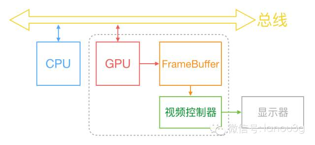
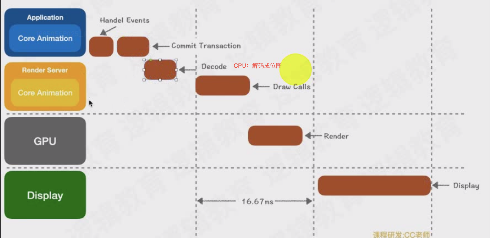
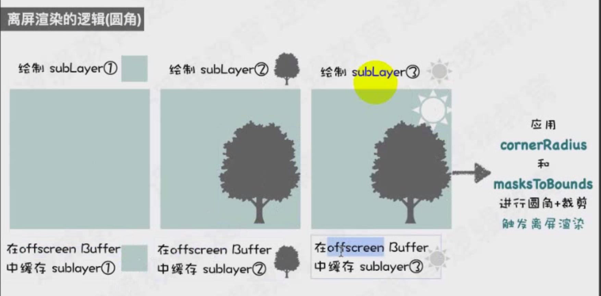

# 屏幕显示图像的原理

## 图形显示过程

光栅扫描显示，通过图像的像素阵列组成。

一行一行的扫描

## 垂直同步信号和水平同步信号

首先从过去的 CRT 显示器原理说起。CRT 的电子枪按照上面方式，从上到下一行行扫描，扫描完成后显示器就呈现一帧画面，随后电子枪回到初始位置继续下一次扫描。

为了把显示器的显示过程和系统的视频控制器进行同步，显示器（或者其他硬件）会用**硬件时钟产生一系列的定时信号**。

电子枪换到新的一行，准备进行扫描时，显示器会发出一个水平同步信号（horizonal synchronization），简称 **HSync；**

当一帧画面绘制完成后，电子枪回复到原位，准备画下一帧前，显示器会发出一个垂直同步信号（vertical synchronization），简称 **VSync**。

显示器通常以固定频率进行刷新，这个刷新率就是 **VSync** 信号产生的频率。

计算机系统中 CPU、GPU、显示器是以上面这种方式协同工作的。

- CPU：在 VSync 信号到来后，系统图形服务会通过 CADisplayLink 等机制通知 App，App 主线程开始在 CPU 中计算显示内容，比如创建视图、计算布局、图片解码、文本绘制等。随后 CPU 会将需要绘制纹理（图片）通过数据总线交给 GPU。
- GPU：纹理混合、顶点变换与计算、像素点的填充计算、将渲染结果放入帧缓冲区（Frame Buffer）。等待下一次 VSync 信号到来时显示到屏幕上。
- Frame Buffer：帧缓存区。（两个缓存区，来回的切换，性能加强）
- iOS 设备双缓冲机制：显示系统通常会引入两个帧缓冲区，双缓冲机制
- Video Controller（视频控制器）：视频控制器按照 VSync 信号逐行读取帧缓冲区的数据，经过可能的数模转换显示在屏幕上。
- 时钟信号：垂直同步信号 V-Sync / 水平同步信号 H-Sync
- Monitor（显示器）：进行显示。

## 双缓冲区Frame Buffer

图像不是直接显示在屏幕上的，有一个帧缓冲区，帧缓存存储器。

- 颜色缓存区
- 深度缓存区 （多个图片重叠，确定哪个显示在上面）

通过计算得到颜色，存放在帧缓存区中。

在最简单的情况下，帧缓冲区只有一个，这时帧缓冲区的读取和刷新都都会有比较大的效率问题。

为了解决效率问题，显示系统通常会引入两个缓冲区，即双缓冲机制。

在这种情况下，GPU 会预先渲染好一帧放入一个缓冲区内，让视频控制器读取，当下一帧渲染好后，GPU 会直接把**视频控制器**的指针指向第二个缓冲区。

**如此一来效率会有很大的提升。**

双缓冲虽然能解决效率问题，但会引入一个新的问题：屏幕撕裂。

## 屏幕撕裂

现象：显示的过程 上半部分和下半部分断层脱节

当视频控制器还未读取完成时，即屏幕内容刚显示一半时，GPU 将新的一帧内容提交到帧缓冲区并把两个缓冲区进行交换后，视频控制器就会把新的一帧数据的下半段显示到屏幕上，造成画面撕裂现象。

单一缓存模式下（CPU->内存->GPU（帧缓冲区））CPU和GPU协作过程中，新的数据就来了，新一帧的数据覆盖了上一帧数据。

解决：通过双缓冲区的交替解决和垂直同步信号机制。

### 垂直同步信号

为了防止在绘制某一帧数据的时候，新一帧数据的影响，GPU 通常有一个机制叫做垂直同步（V-Sync）。某一帧数据没有渲染完最后一个像素，不会发垂直同步信号。显示器发垂直同步信号表明这次绘制完成，才开始下一帧的渲染和缓冲区更新。

这样能解决画面撕裂现象，也增加了画面流畅度，但需要消费更多的计算资源，也会带来部分延迟。

## 卡顿延迟掉帧原理和解决方案

**界面卡顿的原因：**

要显示新的一帧，由于垂直同步的机制，如果在一个 VSync 时间内，CPU 或者 GPU 没有完成内容提交，则那一帧就会被丢弃，缓冲区还是旧的一帧，重复的显示旧帧。

卡顿原因：任务量超过硬件CPU GPU能力，CPU/GPU渲染计算耗时较长导致掉帧。

1秒60帧。屏幕高刷120帧。

解决：

1. 降低界面复杂度。层级少。

2. 通过垂直同步信号和双缓存，强制同步屏幕刷新

   代价：屏幕撕裂，掉帧

### GPU 资源消耗原因和解决方案

GPU 能干的事情比较单一：接收提交的纹理（Texture）和顶点描述（三角形），应用变换（transform）、混合并渲染，然后输出到屏幕上。

通常你所能看到的内容，主要也就是**纹理（图片）和形状（三角模拟的矢量图形）**两类。

**纹理的渲染**

所有的 Bitmap，包括图片、文本、栅格化的内容，最终都要由内存提交到显存，绑定为 GPU Texture。

不论是提交到显存的过程，还是 GPU 调整和渲染 Texture 的过程，都要消耗不少 GPU 资源。

当在较短时间显示大量图片时（比如 TableView 存在非常多的图片并且快速滑动时），CPU 占用率很低，GPU 占用非常高，界面仍然会掉帧。

避免这种情况的方法只能是尽量**减少在短时间内大量图片的显示，尽可能将多张图片合成为一张进行显示**。

当图片过大，超过 GPU 的最大纹理尺寸时，图片需要先由 CPU 进行预处理，这对 CPU 和 GPU 都会带来额外的资源消耗。

目前来说，iPhone 4S 以上机型，纹理尺寸上限都是 4096x4096

**所以，尽量不要让图片和视图的大小超过这个值。**

**视图的混合 (Composing)**

当多个视图（或者说 CALayer）重叠在一起显示时，GPU 会首先把他们混合到一起。如果视图结构过于复杂，混合的过程也会消耗很多 GPU 资源。

为了减轻这种情况的 GPU 消耗，应用应当尽量**减少视图数量和层次**，并在不透明的视图里标明 opaque 属性以避免无用的 Alpha 通道合成。

当然，这也可以用上面的方法，**把多个视图预先渲染为一张图片来显示**。

**图形的生成。**

CALayer 的 border、圆角、阴影、遮罩（mask），CASharpLayer 的矢量图形显示，通常会触发离屏渲染（offscreen rendering），而离屏渲染通常发生在 GPU 中。

当一个列表视图中出现大量圆角的 CALayer，并且快速滑动时，可以观察到 GPU 资源已经占满，而 CPU 资源消耗很少。

这时界面仍然能正常滑动，但平均帧数会降到很低。为了避免这种情况，可以尝试开启 CALayer.shouldRasterize 属性，但这会把原本离屏渲染的操作转嫁到 CPU 上去。

解决办法，就是**把需要显示的图形在后台线程绘制为图片**，避免使用圆角、阴影、遮罩等属性。

## iOS下的渲染框架

## Core Animation 核心动画

## 离屏渲染

离屏渲染检测：

模拟器 --- Debug --- Color Off-screen Rendered 可以查看哪些离屏渲染。

### 离屏渲染本质：

1. 普通渲染：帧缓冲区（必须存在）。
2. 离屏渲染：比普通渲染 多开辟**x个离屏渲染缓存区**（空间浪费，叠加计算），造成性能问题。

### 离屏渲染原因：

1. **无法通过一次性渲染得到，需要分步骤完成。**分步骤完成需要存储临时处理中间结果（离屏缓存区），然后合并（帧缓存区）。

2. 主动打开光栅化 shouldRasterize，如果复用的话可以离屏渲染

   `shouldRasterize` 是用于提高 iOS 开发中视图或图层渲染性能的属性。

   当将其设置为 `true` 时，图层会以图像形式渲染并缓存，这可以显著加快后续的动画和变换操作。

   在 iOS 中，默认情况下，每个视图都有一个背后的图层，负责渲染其内容。当视图的属性（例如位置、缩放或旋转）进行动画或变换时，系统必须为每一帧重新渲染视图的内容，这可能是计算密集型的操作。

   通过设置 `shouldRasterize` 为 `true`，系统会将图层渲染成一张图像，并缓存该图像。之后的动画和变换操作将直接使用这张缓存的图像，而不需要重新渲染视图的内容。这样可以大大减少计算量，提高性能。

   需要注意的是，使用 `shouldRasterize` 属性可能会增加内存消耗，特别是对于复杂的视图层级结构和大尺寸的图层。因此，应该根据具体情况来权衡使用该属性的利弊。

   shouldRasterize光栅化使用建议：

   - layer不能被**复用**，则没有必要打开光栅化。
   - layer不是**静态**的，需要被频繁修改（例：处于动画之中），那么开启离屏渲染反而影响效率。
   - 离屏渲染缓存内容有**时间限制**，缓存内容100ms内容如果没有被使用，那么它就会丢弃，无法进行复用了。
   - 离屏渲染缓存**空间有限**，超过2.5倍屏幕像素大小的话，也会失效，且无法进行复用了。

### 触发离屏渲染的几种情况：

1. 使用了mask的layer（layer.mask）
2. 需要进行裁剪的layer（layer.masksToBounds / view.clipsToBounds）
3. 设置了组透明度为YES，并且透明度不为1的layer（layer.allowsGroupOpacity / layer.opacity）
4. 添加了投影的layer（layer.shadow*）
5. 采用了光栅化的layer（layer.shouldRasterize）
6. 绘制了文字的layer（UILabel，CATextLayer，Core Text等）

#### 圆角触发的离屏渲染

如果图片有三层，就会触发离屏渲染

1. 图片存在背景颜色
2. 图片层
3. border

从3个离屏缓存区获取图层，绘制圆角

**把最后的结果放到帧缓存区中。**

画家算法：先绘制离屏幕较远的图层，然后再绘制距离屏幕较近的图层（根据深度值，确定绘制的顺序）